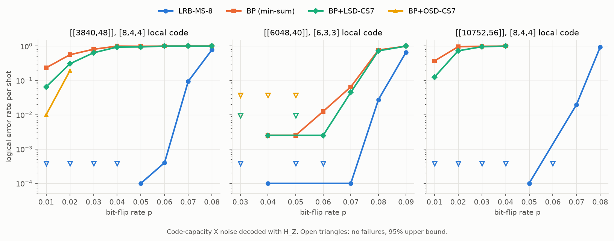
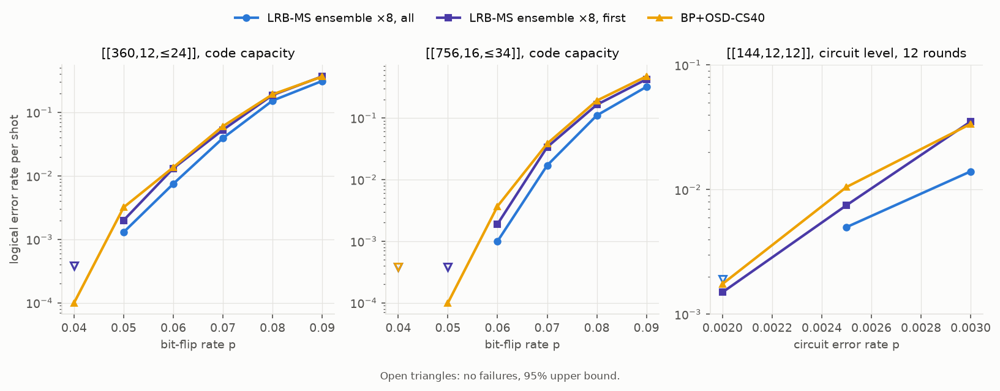

# LRB-MS: Least-Reliable-Basis Min-Sum decoding with generalized checks

`LrbmsDecoder` groups the rows of a parity-check matrix into *generalized checks* (GCs) of `ell`
rows and runs min-sum message passing between variable nodes and GCs. Each GC returns max-log
extrinsic LLRs over its local syndrome coset, approximated by a candidate list built from its
least-reliable basis (LRB-MS-`t`). With one row per GC it reduces exactly to normalised min-sum BP.

Three decoders are included:

| decoder | what it is | best for |
|---|---|---|
| `LrbmsDecoder` | LRB-MS with an optional OSD fallback | codes whose checks form strong local codes (quantum Tanner, GLDPC) |
| `LrbmsEnsembleDecoder` | LRB-MS over several check groupings, keeps the lightest valid output | codes without local structure (bivariate bicycle) |
| `MbpLrbmsDecoder` | MBP4 (quaternary memory BP) variable nodes with LRB-MS checks | depolarizing noise, (μ, α) relay retries |

The check-update rule is selectable (`gc_method`): LRB-MS, exact max-log, exact MAP (Mostad et al.)
or SOGRAND (Rapp et al.). `GmbpDecoder` and `LeadDecoder` reproduce two further related decoders.
The C++ core is in `src_cpp/` and the Python bindings in `ldpc.lrbms_decoder`.

## Highlights

### Large quantum Tanner codes: no failures where BP, BP+LSD and BP+OSD fail most shots



With `[8,4,4]` local codes, standard decoders break down at very low noise: on [[3840,48]] at
p = 0.01, BP fails 23% of shots, BP+LSD-CS7 6.5% and BP+OSD-CS7 1%. LRB-MS-8, with one GC per
Tanner-graph vertex, has **no failures in 10 000 shots up to p = 0.04** on both [8,4,4] codes, and
is **50–9000× faster** there. On [[6048,40]] ([6,3,3] local codes) the baselines hold up at low
noise, but at p = 0.07 LRB-MS-8 fails 1e-4 against 4.5e-2 for BP+LSD-CS7, and is 3–7× faster:

| code | p | **LRB-MS-8** | BP (min-sum) | BP+LSD-CS7 | BP+OSD-CS7 |
|---|---|---|---|---|---|
| [[3840,48]] | 0.01 | **5.5 ms** | 299 ms | 495 ms | 14.4 s |
| [[3840,48]] | 0.02 | **6.9 ms** | 610 ms | 1.3 s | 61 s |
| [[3840,48]] | 0.04 | **12 ms** | 1.1 s | 2.7 s | not run |
| [[6048,40]] | 0.07 | **30 ms** | 90 ms | 212 ms | not run |
| [[10752,56]] | 0.02 | **20 ms** | 3.1 s | 15.9 s | not run |
| [[10752,56]] | 0.04 | **37 ms** | 3.2 s | 18.4 s | not run |

Mean decode time per shot, one core. BP+OSD-CS7 was run only where a shot took under about a
minute. On the smaller Tanner codes (n = 576–2160, [6,3,3] local codes), LRB-MS-8 gives
20–200× fewer logical errors than BP+OSD-CS7 at the same or lower cost.

### Against other generalized-check decoders: the gap widens as local codes grow


Three recent papers also decode each vertex's local code as one check. Their decoders were
implemented here and validated against the papers' numbers:
- exact MAP checks with OSD-1 (GMBP4, Mostad et al.);
- soft-output GRAND lists (SOGRAND, Rapp et al.);
- local BP-LSD feeding a global BP-OSD (LEAD, Xiao et al.).

They ran on the same depolarizing errors as MBP4 + LRB-MS:

| code (checks per vertex), p | **MBP4+LRB-MS (ours)** | GMBP4+OSD-1 [Mostad] | SOGRAND+XZ [Rapp] | LEAD α=0.01 [Xiao] |
|---|---|---|---|---|
| [[432,16,28]] (12), 0.08 | **1.6e-4, 1.1 ms** | 4.2e-4, 71 ms | 6.0e-3, 27 ms | 0.58, 32 ms |
| [[576,32,≤16]] C16 (9), 0.09 | **3.9e-4, 1.4 ms** | 9.5e-4, 20 ms | 4.7e-2, 10 ms | 0.47, 26 ms |
| [[250,10,15]] (6), 0.0685 | 9.5e-4, **0.51 ms** | **2.3e-4**, 2.4 ms | 7.1e-3, 1.4 ms | 0.12, 2.8 ms |

Logical error rate and mean decode time per shot, one core.
- **More checks per vertex:** the exact MAP check and SOGRAND get exponentially more expensive,
  while LRB-MS barely changes. On [[432,16]] LRB-MS is 47–67× faster than GMBP4 and also has
  2.6–6× fewer failures.
- **Small local codes:** on [[250,10,15]] (64-state trellis), GMBP4 is the most accurate, at
  3–5× our time.
- **Post-processing on both sides:** GMBP4 ends with OSD-1. Giving LRB-MS a (μ, α) relay ladder
  instead costs 0–31% extra time. With it, LRB-MS has 6–10× fewer failures than GMBP4+OSD-1 on
  [[432,16]] and 5.6–15× fewer on C16 (p ≥ 0.09), and ties or beats it on [[250,10,15]] at
  p ≥ 0.0685 ([details](docs/benchmarks/related_work.md#post-processing-osd-1-against-a-relay-ladder)).
- **Error floor:** a single pass of LRB-MS has a floor at low noise. On [[250,10,15]] at
  p = 0.0097 it fails 1.5–2.1e-6, against 1.7e-7 for SOGRAND+XZ. The cause is the truncated
  candidate list locking light errors into trapping sets. With the relay ladder there were no
  failures in 24 million shots, at about two thirds of SOGRAND's time
  ([details](docs/benchmarks/related_work.md#error-floor-at-low-noise)).

### BB codes: the grouping ensemble beats BP+OSD, and the gap grows with code size



BB checks do not form strong local codes, so a single LRB-MS decoder only matches BP+OSD. An
ensemble over 8 check groupings, keeping the lightest valid output, gives **3.7× fewer failures
than BP+OSD-CS40 on [[756,16,≤34]] at p = 0.06**, 2.5× on [[360,12,≤24]] at p = 0.05, and
2.1–2.4× at circuit level on [[144,12,12]] (12 rounds, p = 0.0025–0.003). It costs more time:

| code, p | **ensemble ×8, all** | ensemble ×8, first | BP+OSD-CS40 | BP+OSD-CS7 |
|---|---|---|---|---|
| [[360,12,≤24]], 0.05 | 7.8 ms | 1.4 ms | 0.6 ms | 0.5 ms |
| [[756,16,≤34]], 0.06 | 23.6 ms | 4.0 ms | 2.2 ms | 2.0 ms |
| [[756,16,≤34]], 0.07 | 63.8 ms | 21.3 ms | 9.3 ms | 6.4 ms |
| [[144,12,12]] circuit, 0.0025 | 3.7 s | 305 ms | 296 ms | 367 ms |
| [[144,12,12]] circuit, 0.003 | 5.4 s | 776 ms | 656 ms | 644 ms |

The `stop="escalate"` mode (run the other groupings only when the first one fails) keeps the
accuracy of "all" at a third of its cost: on [[756,16,≤34]] at p = 0.065, 4.0e-3 at 5.9 ms
against 4.0e-3 at 15.9 ms.

### Relay ladders: 11–20× fewer failures at no extra cost

![(μ, α) relay ladders on [[288,12,18]]](docs/figures/relay_ladder.png)

`MbpLrbmsDecoder` under depolarizing noise (p total, p/3 per Pauli). When a decode does not
converge, it is retried with new (μ, α) scalings. Changing α as well as μ roughly doubles the gain
of μ-only retries. Retries fire on fewer than 0.1% of shots, so the cost is unchanged:

| [[288,12,18]] | base (0.75, 1) | μ-only ladder | **(μ, α) ladder** |
|---|---|---|---|
| p = 0.065, 600k shots | 0.61 ms | 0.61 ms | **0.60 ms** |
| p = 0.075, 120k shots | 0.81 ms | 0.87 ms | **0.84 ms** |

On [[144,12,12]] most remaining failures are wrong convergences, which a retry cannot see. There,
keeping the lightest output of 3 tuned (μ, α) legs gives ×2.0 for about 3× the time
(0.27 → 0.84 ms per shot at p = 0.06).

> Timing note: the large Tanner, large BB and circuit-level runs shared the machine with a leftover
> background job, so their absolute times are likely about 2× too high. Relative speeds and all
> error rates are unaffected.

## Detailed results

| benchmark | contents |
|---|---|
| [Quantum Tanner codes](docs/benchmarks/quantum_tanner.md) | n = 576–10 752, full error-rate and timing tables, LRB order, exact trellis, OSD fallback |
| [Bivariate bicycle codes](docs/benchmarks/bb_codes.md) | [[72]] to [[756]], single LRB-MS vs ensembles, minimum-weight headroom estimate |
| [Circuit-level noise](docs/benchmarks/circuit_level.md) | BB [[144,12,12]] memory experiment, detector groupings |
| [Related decoders](docs/benchmarks/related_work.md) | exact-MAP GMBP4, SOGRAND and LEAD reimplemented, validated against their papers and compared with LRB-MS |
| [Relay ladders](docs/benchmarks/relay_ladders.md) | (μ, α) sweeps, ladder search, lightest-of-k, verification of reported ladders |

## Installation

Python 3.10 or newer and a C++ compiler are required.

```bash
git clone https://github.com/nakadachi/LRB-MS-extension.git
cd LRB-MS-extension
pip install -e .
```

The package installs under the import name `ldpc`.

## Quickstart

```python
from ldpc import LrbmsDecoder
from ldpc.lrbms_decoder import LrbmsEnsembleDecoder, MbpLrbmsDecoder

# Single decoder: GCs of 9 rows grown greedily from overlapping checks
decoder = LrbmsDecoder(H, error_rate=0.05, check_groups=9, lrbms_order=8,
                       max_iter=100, ms_scaling_factor=0.75, schedule="serial")
correction = decoder.decode(syndrome)

# Ensemble over 8 groupings, OSD fallback on each
ensemble = LrbmsEnsembleDecoder(H, error_rate=0.05, ell=8, num_groupings=8, stop="escalate",
                                osd_method="osd_cs", osd_order=7)
correction = ensemble.decode(syndrome)

# Depolarizing noise on a CSS code; change mu / alpha between decodes for relay retries
hybrid = MbpLrbmsDecoder(hx, hz, error_rate=0.06, x_groups=6, z_groups=6,
                         max_iter=1000, mu=0.75, alpha=1.0, lrbms_order=6)
error_x, error_z = hybrid.decode(syndrome_x, syndrome_z)
```

All options (grouping helpers, ensemble modes, the MBP4 update, sinter integration) are described
in [docs/usage.md](docs/usage.md). Tests: `pytest python_test/test_lrbms.py`.

## Reproducing

The benchmark scripts and raw results are in [`examples/`](examples): `qtanner/`, `bb/`,
`bb_circuit/` and the relay-ladder scripts `mbp_*.py`. The figures above are made by
`python docs/figures/make_figures.py`.

## License

MIT, see [LICENSE](LICENSE). This project is built on a fork of the `ldpc` package.
