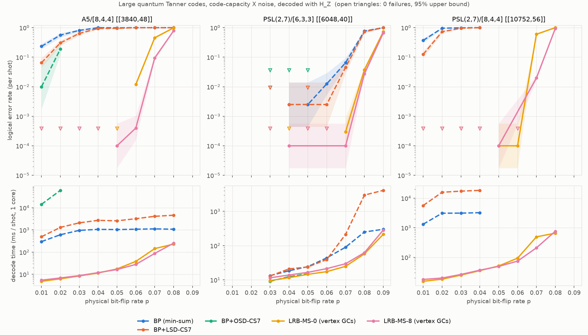
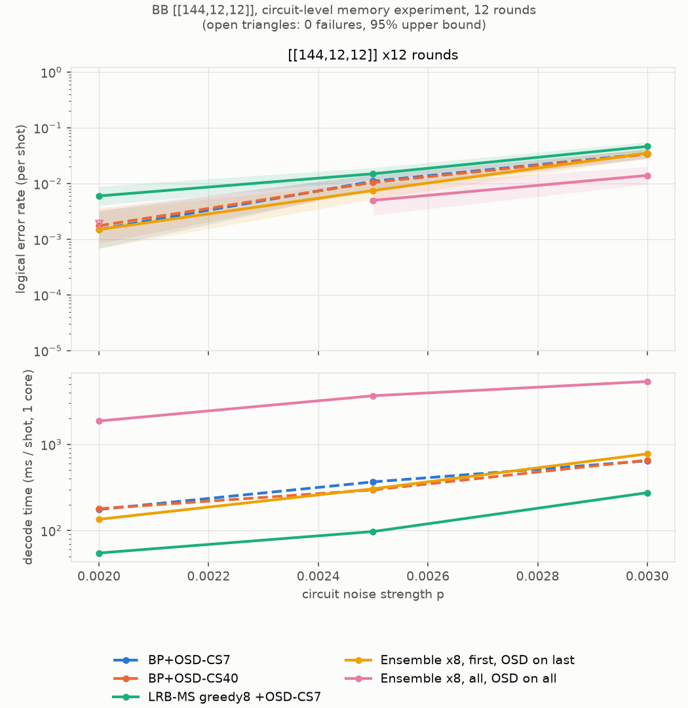

# LRB-MS: Least-Reliable-Basis Min-Sum decoding with generalized checks

`LrbmsDecoder` groups the rows of a parity-check matrix into *generalized checks*
(GCs) of `ell` rows, and runs min-sum message passing between variable nodes and GCs.
Each GC returns max-log extrinsic LLRs over its local syndrome coset. These are approximated by a
candidate list built from its least-reliable basis (LRB-MS-`t`), or computed exactly with
a 2^`ell`-state syndrome trellis (`gc_method="trellis"`, a reference baseline).
With one row per GC it reduces exactly to (normalised) min-sum BP.

The C++ core lives in `src_cpp/lrbms.hpp` and the Python bindings in `ldpc.lrbms_decoder`.

## Results at a glance

| setting | best LRB-MS variant | compared with | result |
|---|---|---|---|
| Quantum Tanner codes, n = 576–2160 | LRB-MS-8, one GC per vertex | BP+OSD-CS7 | 20–200× fewer logical errors, similar or lower decode time |
| Quantum Tanner codes, [8,4,4] local codes, n = 3840 and 10752 | LRB-MS-8, one GC per vertex | BP, BP+LSD-CS7, BP+OSD-CS7 | no failures in 10 000 shots up to p = 0.04, where the baselines fail most or all shots; 200–9000× faster |
| BB codes [[360,12]], [[756,16]], code capacity | ensemble ×8 over groupings | BP+OSD-CS40 | 1.7–3.7× fewer logical errors, about 10× the decode time |
| BB [[144,12,12]], circuit-level, 12 rounds | ensemble ×8 over groupings | BP+OSD-CS7/CS40 | 2.1–2.4× fewer logical errors at p = 0.0025–0.003, about 10× the decode time |
| BB [[288,12,18]], total depolarizing p | MBP4 + LRB-MS with a (μ, α) relay ladder | the same decoder without retries | 11–20× fewer logical errors at p = 0.06–0.075, same average decode time |
| BB [[144,12,12]], total depolarizing p | MBP4 + LRB-MS, lightest of 3–5 (μ, α) legs | the same decoder, single leg | 3.0–4.1× fewer logical errors at p = 0.06, 2.6–5× the decode time; a stopping ladder gives only ×1.7 |

LRB-MS gains the most when groups of checks form strong local codes, as in Tanner-type codes.
On BB codes a single LRB-MS decoder is not better than BP+OSD, and the gain comes from the ensemble.

## Installation

Python 3.10 or newer and a C++ compiler are required.

```bash
git clone https://github.com/nakadachi/LRB-MS-extension.git
cd LRB-MS-extension
pip install -e .
```

The package installs under the import name `ldpc`.

## Quickstart

```python
import numpy as np
from ldpc import LrbmsDecoder
from ldpc.lrbms_decoder import overlap_check_groups, consecutive_check_groups

decoder = LrbmsDecoder(
    H,                       # np.ndarray or scipy.sparse parity-check matrix
    error_rate=0.05,         # or error_channel=[...]
    check_groups=9,          # int ell (greedy overlap grouping) or an explicit list of row lists
    lrbms_order=8,           # LRB-MS-t: order-2 re-encodings among the t least-reliable MRB positions
    gc_method="lrbms",       # or "trellis" (exact min-sum per GC, ell <= 22)
    schedule="serial",       # "parallel" (flooding) or "serial" (layered over GCs)
    max_iter=100,
    ms_scaling_factor=0.75,
    osd_method="off",        # optional fallback when LRB-MS does not converge: "osd_0", "osd_cs", "osd_e"
    osd_order=0,
)
correction = decoder.decode(syndrome)
decoder.converge, decoder.iterations, decoder.log_prob_ratios, decoder.osd_used
```

### Choosing the generalized checks

- `check_groups=None` gives one row per GC, which is plain min-sum BP.
- `check_groups=ell` (an integer) uses `overlap_check_groups(H, ell)`. Each group is grown
  greedily from rows that share the most columns.
- `consecutive_check_groups(m, ell)` makes blocks of consecutive rows. Use it when neighbouring
  rows already form a component code (GLDPC or Tanner-type constructions).
- You can also pass an explicit list of row lists. Every nonzero row must be covered.
- Groups should partition the rows. Putting a row in two groups counts its evidence twice and
  makes decoding much worse.

### Ensemble over groupings

`LrbmsEnsembleDecoder` runs LRB-MS once per check grouping and returns the syndrome-valid output
with the lowest channel cost. Different groupings put the GC boundaries in different places, so
their failures are only weakly correlated. This helps most on codes without a natural local-code
structure, such as bivariate bicycle codes (see the benchmark below).

```python
from ldpc.lrbms_decoder import LrbmsEnsembleDecoder

decoder = LrbmsEnsembleDecoder(
    H, error_rate=0.05,
    ell=8, num_groupings=8,  # greedy groupings grown from permuted row orders
                             # (or pass groupings=[...] explicitly)
    stop="escalate",         # "escalate": accept the first grouping if it converges, else run all (recommended)
                             # "all": always run every grouping; "first": stop at the first converged one
    osd_members="all",       # OSD fallback on every grouping ("last": only on the last one)
    osd_method="osd_cs", osd_order=7,
    max_iter=100, ms_scaling_factor=0.75, schedule="serial",
)
correction = decoder.decode(syndrome)
decoder.converge, decoder.member
```

**Choosing the mode.** The ensemble's gain comes almost entirely from shots where the first grouping
does not converge. In those shots, OSD on several groupings' soft outputs gives several candidates,
and the lightest one is usually right. Choosing among groupings that all converged gains nothing:
"all", with OSD only when nothing converged, is no better than "first". Agreement-based and
weight-based stopping rules also gained nothing. So `stop="escalate"` runs the extra groupings only
when the first one fails. On BB codes at code capacity, with 8 groupings, it matched "all" in accuracy
at a fraction of the cost:

| code, p | all | **escalate** | first |
|---|---|---|---|
| [[288,12,18]], 0.06 | 1.30e-2, 5.6 ms | **1.32e-2, 2.9 ms** | 1.95e-2, 1.9 ms |
| [[756,16,≤34]], 0.065 | 4.0e-3, 15.9 ms | **4.0e-3, 5.9 ms** | 6.5e-3, 3.3 ms |

Escalate costs about 3–4× a single LRB-MS decode, instead of about 8× for "all". The groupings
are independent, so running them in parallel would cut the latency further. Capping `max_iter`
per grouping helps on some codes: on [[288,12,18]], 10 iterations kept the accuracy and cut the
"all" time by about 37%. It hurts on others: on [[756,16,≤34]] more groupings fall back to OSD,
and the time grows. The script is `examples/bb/ensemble_policies.py`. The benchmark tables
below were measured with "all" and "first".

### MBP4 + LRB-MS hybrid (depolarizing noise)

`MbpLrbmsDecoder` decodes the X and Z parts of a CSS-code error jointly. Each qubit keeps
quaternary log-ratios Γᵂ = ln P(I)/P(W), for W = X, Y, Z, updated with the MBP4 rule of
Kuo and Lai. The checks are LRB-MS generalized checks, grouped within one check type: a Z-type
group sees only the x-part of each qubit's error, and an X-type group only the z-part. The
decoder has two scaling knobs:

- **μ (`mu`)** scales each check group's output (min-sum normalisation at the check nodes).
- **α (`alpha`)** weights incoming check messages by 1/α in each qubit's posterior. The message
  back to a check subtracts that check's previous output without the 1/α factor, which is
  MBP's memory / inhibition effect for α < 1.

With p_Y = p_Z = 0 and α = 1, the decoder reproduces binary LRB-MS exactly (tested).

```python
from ldpc.lrbms_decoder import MbpLrbmsDecoder

dec = MbpLrbmsDecoder(hx, hz, error_rate=0.06,      # depolarizing p (p/3 per Pauli); or channel=(px, py, pz)
                      x_groups=6, z_groups=6,       # groupings of the rows of hx / hz
                      max_iter=1000, mu=0.75, alpha=1.0, lrbms_order=6, schedule="serial")
ex, ez = dec.decode(hx @ ez_true % 2, hz @ ex_true % 2)
dec.converge
dec.mu, dec.alpha = 1.0, 0.9                        # change the knobs between decodes (e.g. relay retries)
```

### Sinter

For stim/sinter workflows use `ldpc.sinter_decoders.SinterLrbmsDecoder`.

### Tests

```bash
pytest python_test/test_lrbms.py
```

The tests check four things:
- `ell = 1` reproduces min-sum BP exactly.
- The trellis matches brute-force max-log.
- LRB-MS is exact whenever its candidate list covers the coset.
- The OSD fallback works.
- The ensemble returns the cheapest valid member output, and `stop="escalate"` matches `"all"`
  whenever the first grouping fails.
- The MBP4 + LRB-MS hybrid reproduces binary LRB-MS for pure X noise with α = 1.

## Benchmark: quantum Tanner codes

We compared LRB-MS with min-sum BP and BP+OSD on four Leverrier–Zémor quantum Tanner codes.
Each one is built on a group `G` with generating sets `|A| = |B| = 6` and `[6,3,3]` local codes.
Every vertex of the Cayley complex contributes a 9-row local tensor code, and LRB-MS uses one GC
per vertex. `overlap_check_groups(H, 9)` recovers exactly these groups.

The noise is code-capacity bit flips: independent X errors with probability `p`, decoded from
`H_Z`. A shot fails if the residual has a nonzero syndrome or is a nontrivial logical. At each
`(code, p)`, every decoder decodes the same error samples. A point stops at 100 failures or
20 000 shots (3 000 shots for the trellis). All decoders use a serial schedule, at most 100
iterations, and min-sum scaling 0.75, the value a sweep found best for both BP and LRB-MS.
Distances are upper bounds from a random information-set search. Times are per shot on one core.


### Logical error rate per shot

`0 (/N)` means no failures in `N` shots.

**[[576,32,≤16]] (C16)**

| decoder | 0.02 | 0.03 | 0.04 | 0.05 | 0.06 | 0.07 | 0.08 | 0.09 | ms/shot @ p=0.05 |
|---|---|---|---|---|---|---|---|---|---|
| BP (min-sum) | 4.5e-04 | 2.4e-03 | 8.7e-03 | 4.3e-02 | 1.4e-01 | 3.8e-01 | 6.1e-01 | 8.5e-01 | 0.84 |
| BP+OSD-CS7 | 4.0e-04 | 1.9e-03 | 7.7e-03 | 3.7e-02 | 1.2e-01 | 3.5e-01 | 5.8e-01 | 8.3e-01 | 1.25 |
| BP(PS)+OSD-CS7 | 5.0e-04 | 2.6e-03 | 9.3e-03 | 3.6e-02 | 1.1e-01 | 3.1e-01 | 5.6e-01 | 8.3e-01 | 4.07 |
| **LRB-MS-0** | 0 (/20000) | 0 (/20000) | 2.5e-04 | 2.0e-03 | 1.6e-02 | 9.2e-02 | 3.0e-01 | 6.2e-01 | 0.50 |
| **LRB-MS-8** | 0 (/20000) | 5.0e-05 | 1.0e-04 | 1.4e-03 | 1.2e-02 | 8.4e-02 | 2.8e-01 | 5.8e-01 | 0.60 |
| **LRB-MS-8+OSD-CS7** | 0 (/20000) | 5.0e-05 | 1.0e-04 | 1.1e-03 | 1.1e-02 | 8.7e-02 | 2.7e-01 | 5.8e-01 | 0.68 |
| Exact GC (trellis) | 0 (/3200) | 0 (/3200) | 0 (/3200) | 9.4e-04 | 1.3e-02 | 9.5e-02 | 3.3e-01 | 6.3e-01 | 6.25 |

**[[864,22,≤18]] (SL(2,3))**

| decoder | 0.02 | 0.03 | 0.04 | 0.05 | 0.06 | 0.07 | 0.08 | 0.09 | ms/shot @ p=0.05 |
|---|---|---|---|---|---|---|---|---|---|
| BP (min-sum) | 0 (/20000) | 3.5e-04 | 1.4e-03 | 1.2e-02 | 6.6e-02 | 3.4e-01 | 6.8e-01 | 8.9e-01 | 1.08 |
| BP+OSD-CS7 | 0 (/20000) | 1.0e-04 | 9.5e-04 | 8.4e-03 | 5.7e-02 | 2.9e-01 | 6.3e-01 | 8.7e-01 | 1.35 |
| BP(PS)+OSD-CS7 | 3.0e-04 | 1.8e-03 | 4.2e-03 | 1.3e-02 | 6.4e-02 | 3.4e-01 | 6.0e-01 | 8.4e-01 | 5.32 |
| **LRB-MS-0** | 0 (/20000) | 0 (/20000) | 0 (/20000) | 1.0e-04 | 3.4e-03 | 5.2e-02 | 2.7e-01 | 6.2e-01 | 0.76 |
| **LRB-MS-8** | 0 (/20000) | 0 (/20000) | 0 (/20000) | 5.0e-05 | 2.9e-03 | 4.9e-02 | 2.5e-01 | 6.1e-01 | 0.86 |
| **LRB-MS-8+OSD-CS7** | 0 (/20000) | 0 (/20000) | 0 (/20000) | 5.0e-05 | 2.5e-03 | 4.5e-02 | 2.3e-01 | 6.1e-01 | 0.90 |
| Exact GC (trellis) | 0 (/3200) | 0 (/3200) | 0 (/3200) | 0 (/3200) | 3.4e-03 | 7.2e-02 | 3.0e-01 | 6.5e-01 | 9.17 |

**[[1080,24,≤18]] (D30)**

| decoder | 0.02 | 0.03 | 0.04 | 0.05 | 0.06 | 0.07 | 0.08 | 0.09 | ms/shot @ p=0.05 |
|---|---|---|---|---|---|---|---|---|---|
| BP (min-sum) | 0 (/20000) | 4.0e-04 | 2.7e-03 | 1.3e-02 | 5.7e-02 | 2.8e-01 | 6.2e-01 | 9.5e-01 | 1.35 |
| BP+OSD-CS7 | 0 (/20000) | 2.0e-04 | 1.8e-03 | 8.9e-03 | 4.1e-02 | 2.3e-01 | 5.9e-01 | 9.3e-01 | 1.53 |
| BP(PS)+OSD-CS7 | 4.5e-04 | 2.2e-03 | 7.8e-03 | 2.0e-02 | 5.1e-02 | 2.7e-01 | 6.0e-01 | 9.0e-01 | 7.63 |
| **LRB-MS-0** | 0 (/20000) | 0 (/20000) | 0 (/20000) | 1.0e-04 | 2.2e-03 | 3.7e-02 | 2.5e-01 | 6.6e-01 | 0.87 |
| **LRB-MS-8** | 0 (/20000) | 0 (/20000) | 0 (/20000) | 5.0e-05 | 1.4e-03 | 2.8e-02 | 2.2e-01 | 6.3e-01 | 1.06 |
| **LRB-MS-8+OSD-CS7** | 0 (/20000) | 0 (/20000) | 0 (/20000) | 0 (/20000) | 1.0e-03 | 2.4e-02 | 2.1e-01 | 6.1e-01 | 1.09 |
| Exact GC (trellis) | 0 (/3200) | 0 (/3200) | 0 (/3200) | 0 (/3200) | 2.5e-03 | 3.9e-02 | 2.6e-01 | 6.7e-01 | 11.45 |

**[[2160,24]] (A5)**

| decoder | 0.02 | 0.03 | 0.04 | 0.05 | 0.06 | 0.07 | 0.08 | 0.09 | ms/shot @ p=0.05 |
|---|---|---|---|---|---|---|---|---|---|
| BP (min-sum) | 0 (/20000) | 1.0e-04 | 9.5e-04 | 5.1e-03 | 2.5e-02 | 1.8e-01 | 6.9e-01 | 9.7e-01 | 2.45 |
| BP+OSD-CS7 | 0 (/20000) | 0 (/20000) | 2.0e-04 | 9.0e-04 | 9.7e-03 | 1.3e-01 | 6.5e-01 | 9.6e-01 | 4.32 |
| BP(PS)+OSD-CS7 | 1.4e-03 | 5.6e-03 | 1.8e-02 | 3.9e-02 | 8.6e-02 | 2.6e-01 | 6.6e-01 | 9.5e-01 | 79.48 |
| **LRB-MS-0** | 0 (/20000) | 0 (/20000) | 0 (/20000) | 0 (/20000) | 5.0e-05 | 4.0e-03 | 1.3e-01 | 6.5e-01 | 1.88 |
| **LRB-MS-8** | 0 (/20000) | 0 (/20000) | 0 (/20000) | 0 (/20000) | 5.0e-05 | 2.7e-03 | 1.1e-01 | 6.1e-01 | 2.21 |
| **LRB-MS-8+OSD-CS7** | 0 (/20000) | 0 (/20000) | 0 (/20000) | 0 (/20000) | 0 (/20000) | 2.7e-03 | 1.1e-01 | 5.9e-01 | 2.27 |
| Exact GC (trellis) | 0 (/3200) | 0 (/3200) | 0 (/3200) | 0 (/3200) | 0 (/3200) | 4.7e-03 | 1.7e-01 | 7.1e-01 | 26.40 |


### Findings

- **LRB-MS lowers the logical error rate by 20–200×** compared with BP and BP+OSD-CS7, wherever
  both can be measured. The rise in failures moves from p ≈ 0.03–0.04 to p ≈ 0.06–0.07.
- **It is as fast as or faster than the baselines.** For p ≤ 0.06, LRB-MS-8 costs about the same
  as plain min-sum BP, and it is cheaper than BP+OSD from p = 0.05 upwards.
- **OSD does not rescue BP on these codes.** When BP fails to converge, OSD-CS7 returns a
  correction that satisfies the syndrome but is much heavier than the true error, so the result
  is a logical error. Product-sum BP gives OSD worse soft information and is 4–40× slower.
- **The grouping is where the gain comes from.** LRB-MS-0 (order-1 re-encodings only) already
  captures most of it. Order 8 improves the error rate by a further 1.2–1.5× for about 20% more time.
- **The exact per-GC trellis matches LRB-MS-8 but runs 5–30× slower**, so the LRB candidate list
  is not the bottleneck. An OSD fallback after LRB-MS helps by at most 1.2×.

The code construction, benchmark scripts and raw data (`results.json`) are in
[`examples/qtanner`](examples/qtanner/README.md).

### Larger codes: up to n = 10 752

We scaled the benchmark to three larger quantum Tanner codes. Two of them use the stronger
`[8,4,4]` extended-Hamming local code, which gives 16 rows per vertex and 64-qubit local views:

| code | group | local code | n | k |
|---|---|---|---|---|
| [[3840,48]] | A5 | [8,4,4] | 3840 | 48 |
| [[6048,40]] | PSL(2,7) | [6,3,3] | 6048 | 40 |
| [[10752,56]] | PSL(2,7) | [8,4,4] | 10752 | 56 |

The setup is the same as above: code-capacity bit flips, paired samples, serial schedules, at most
100 iterations, scaling 0.75. LRB-MS points run up to 10 000 shots. The baselines are capped at
400 shots (BP, BP+LSD-CS7) or 100 shots (BP+OSD-CS7), because they take seconds per shot.
BP+OSD-CS7 ran only at the lowest noise levels; at higher noise or on the largest code a single
shot takes minutes. On [[10752,56]], BP and BP+LSD were skipped for p ≥ 0.05, after they had
already failed every shot at p = 0.04. "—" means not run.



> **Timing caveat:** while this benchmark ran, a leftover background job occupied the same 4 cores,
> so the absolute decode times in this section are likely about 2× too high. The extra load was
> constant throughout, so the relative speeds of the decoders should be roughly preserved.
> Logical error rates are unaffected.

**[[3840,48]] (A5/[8,4,4])**

| decoder | 0.01 | 0.02 | 0.03 | 0.04 | 0.05 | 0.06 | 0.07 | 0.08 |
|---|---|---|---|---|---|---|---|---|
| BP (min-sum) | 2.3e-01 | 5.6e-01 | 8.1e-01 | 1.0e+00 | 9.9e-01 | 1.0e+00 | 1.0e+00 | 1.0e+00 |
| BP+LSD-CS7 | 6.5e-02 | 3.0e-01 | 6.4e-01 | 9.4e-01 | 9.5e-01 | 1.0e+00 | 1.0e+00 | 1.0e+00 |
| BP+OSD-CS7 | 1.0e-02 | 1.9e-01 | — | — | — | — | — | — |
| **LRB-MS-0** | 0 (/10000) | 0 (/10000) | 0 (/10000) | 0 (/10000) | 0 (/10000) | 1.2e-02 | 4.6e-01 | 9.8e-01 |
| **LRB-MS-8** | 0 (/10000) | 0 (/10000) | 0 (/10000) | 0 (/10000) | 1.0e-04 | 4.0e-04 | 9.4e-02 | 7.8e-01 |

Mean decode time per shot (one core):

| decoder | 0.01 | 0.02 | 0.03 | 0.04 | 0.05 | 0.06 | 0.07 | 0.08 |
|---|---|---|---|---|---|---|---|---|
| BP (min-sum) | 299 ms | 610 ms | 959 ms | 1.1 s | 1.0 s | 1.1 s | 1.1 s | 1.1 s |
| BP+LSD-CS7 | 495 ms | 1.3 s | 2.1 s | 2.7 s | 2.6 s | 3.2 s | 4.1 s | 4.6 s |
| BP+OSD-CS7 | 14.4 s | 61.0 s | — | — | — | — | — | — |
| **LRB-MS-0** | 5 ms | 6 ms | 8 ms | 11 ms | 17 ms | 38 ms | 144 ms | 230 ms |
| **LRB-MS-8** | 5 ms | 7 ms | 9 ms | 12 ms | 16 ms | 28 ms | 87 ms | 253 ms |

**[[6048,40]] (PSL(2,7)/[6,3,3])**

| decoder | 0.03 | 0.04 | 0.05 | 0.06 | 0.07 | 0.08 | 0.09 |
|---|---|---|---|---|---|---|---|
| BP (min-sum) | 0 (/400) | 2.5e-03 | 2.5e-03 | 1.3e-02 | 6.5e-02 | 7.7e-01 | 1.0e+00 |
| BP+LSD-CS7 | 0 (/400) | 2.5e-03 | 0 (/400) | 2.5e-03 | 4.5e-02 | 7.3e-01 | 1.0e+00 |
| BP+OSD-CS7 | 0 (/100) | 0 (/100) | 0 (/100) | — | — | — | — |
| **LRB-MS-0** | 0 (/10000) | 0 (/10000) | 0 (/10000) | 0 (/10000) | 3.0e-04 | 3.8e-02 | 7.3e-01 |
| **LRB-MS-8** | 0 (/10000) | 1.0e-04 | 0 (/10000) | 0 (/10000) | 1.0e-04 | 2.8e-02 | 6.7e-01 |

Mean decode time per shot (one core):

| decoder | 0.03 | 0.04 | 0.05 | 0.06 | 0.07 | 0.08 | 0.09 |
|---|---|---|---|---|---|---|---|
| BP (min-sum) | 13 ms | 18 ms | 24 ms | 44 ms | 90 ms | 250 ms | 300 ms |
| BP+LSD-CS7 | 13 ms | 21 ms | 24 ms | 39 ms | 212 ms | 3.0 s | 4.1 s |
| BP+OSD-CS7 | 9 ms | 12 ms | 15 ms | — | — | — | — |
| **LRB-MS-0** | 10 ms | 12 ms | 15 ms | 17 ms | 25 ms | 58 ms | 213 ms |
| **LRB-MS-8** | 12 ms | 14 ms | 17 ms | 21 ms | 30 ms | 62 ms | 285 ms |

**[[10752,56]] (PSL(2,7)/[8,4,4])**

| decoder | 0.01 | 0.02 | 0.03 | 0.04 | 0.05 | 0.06 | 0.07 | 0.08 |
|---|---|---|---|---|---|---|---|---|
| BP (min-sum) | 3.7e-01 | 9.6e-01 | 9.9e-01 | 1.0e+00 | — | — | — | — |
| BP+LSD-CS7 | 1.2e-01 | 7.3e-01 | 9.6e-01 | 1.0e+00 | — | — | — | — |
| BP+OSD-CS7 | — | — | — | — | — | — | — | — |
| **LRB-MS-0** | 0 (/10000) | 0 (/10000) | 0 (/10000) | 0 (/10000) | 1.0e-04 | 1.0e-04 | 6.0e-01 | 1.0e+00 |
| **LRB-MS-8** | 0 (/10000) | 0 (/10000) | 0 (/10000) | 0 (/10000) | 1.0e-04 | 0 (/10000) | 2.0e-02 | 9.4e-01 |

Mean decode time per shot (one core):

| decoder | 0.01 | 0.02 | 0.03 | 0.04 | 0.05 | 0.06 | 0.07 | 0.08 |
|---|---|---|---|---|---|---|---|---|
| BP (min-sum) | 1.3 s | 3.1 s | 3.1 s | 3.2 s | — | — | — | — |
| BP+LSD-CS7 | 5.7 s | 15.9 s | 17.4 s | 18.4 s | — | — | — | — |
| BP+OSD-CS7 | — | — | — | — | — | — | — | — |
| **LRB-MS-0** | 15 ms | 18 ms | 25 ms | 35 ms | 51 ms | 93 ms | 492 ms | 656 ms |
| **LRB-MS-8** | 18 ms | 20 ms | 26 ms | 37 ms | 49 ms | 74 ms | 209 ms | 761 ms |


**Findings on the larger codes**

- **With [8,4,4] local codes, the standard decoders break down at very low noise.** At p = 0.01 on
  [[3840,48]], BP fails 23% of shots, BP+LSD-CS7 6.5% and BP+OSD-CS7 1% (at 14 s per shot).
  LRB-MS-8 has no failures in 10 000 shots at up to p = 0.04, and fails 1e-4 at p = 0.05.
  On [[10752,56]], BP and BP+LSD fail every shot from p = 0.04, while LRB-MS has no failures in
  10 000 shots at p = 0.04 and 0.06.
- **LRB-MS is also far faster.** On [[3840,48]] at p = 0.02, LRB-MS-8 takes 7 ms per shot, against
  1.3 s for BP+LSD-CS7 and 61 s for BP+OSD-CS7, roughly 200× and 9 000× faster. On [[10752,56]]
  it takes 18–75 ms per shot for p ≤ 0.06, while BP+LSD takes 5–18 s.
- **With [6,3,3] local codes (n = 6048), the baselines hold up at low noise, but LRB-MS still wins
  where failures start.** At p = 0.07, BP+LSD-CS7 fails 4.5% at 212 ms per shot, while LRB-MS-8
  fails 1e-4 at 30 ms.
- **The stronger the local code, the larger the gain.** The [8,4,4] codes hurt the baselines far more
  than the [6,3,3] codes do. A likely reason is that their dense 16-row local checks form many short
  cycles inside each vertex, which defeat plain message passing, whereas LRB-MS solves each vertex's
  local code jointly.


## Benchmark: bivariate bicycle codes

We ran the same code-capacity bit-flip benchmark on the bivariate bicycle (BB) codes of
Bravyi et al. (arXiv:2308.07915): [[72,12,6]], [[144,12,12]] and [[288,12,18]].
Decoding uses `H_Z`, and every decoder sees the same error samples.
A point stops at 100 failures or 20 000 shots.
All decoders use a serial schedule, at most 100 iterations and min-sum scaling 0.75.
The ensembles use 8 greedy `ell = 8` groupings.


### Logical error rate per shot

`0 (/N)` means no failures in `N` shots.

**[[72,12,6]]**

| decoder | 0.03 | 0.04 | 0.05 | 0.06 | 0.07 | 0.08 | ms/shot @ p=0.05 |
|---|---|---|---|---|---|---|---|
| BP (min-sum) | 3.0e-02 | 8.3e-02 | 1.5e-01 | 2.4e-01 | 3.7e-01 | 4.7e-01 | 0.06 |
| BP+OSD-CS7 | 3.0e-02 | 7.9e-02 | 1.5e-01 | 2.4e-01 | 3.6e-01 | 4.5e-01 | 0.07 |
| BP+OSD-CS40 | 3.0e-02 | 7.9e-02 | 1.5e-01 | 2.4e-01 | 3.6e-01 | 4.5e-01 | 0.09 |
| LRB-MS ell=8 + OSD-CS7 | 3.3e-02 | 8.0e-02 | 1.7e-01 | 2.4e-01 | 3.8e-01 | 4.6e-01 | 0.09 |
| **Ensemble ×8, first** | 3.5e-02 | 8.0e-02 | 1.7e-01 | 2.4e-01 | 3.8e-01 | 4.6e-01 | 0.11 |
| **Ensemble ×8, all** | 3.0e-02 | 7.2e-02 | 1.6e-01 | 2.3e-01 | 3.6e-01 | 4.6e-01 | 0.49 |

**[[144,12,12]]**

| decoder | 0.03 | 0.04 | 0.05 | 0.06 | 0.07 | 0.08 | ms/shot @ p=0.05 |
|---|---|---|---|---|---|---|---|
| BP (min-sum) | 3.3e-03 | 2.0e-02 | 5.8e-02 | 1.7e-01 | 2.8e-01 | 4.5e-01 | 0.10 |
| BP+OSD-CS7 | 1.4e-03 | 8.3e-03 | 2.5e-02 | 1.0e-01 | 1.8e-01 | 3.1e-01 | 0.12 |
| BP+OSD-CS40 | 1.3e-03 | 7.8e-03 | 2.2e-02 | 9.0e-02 | 1.6e-01 | 2.9e-01 | 0.16 |
| LRB-MS ell=8 + OSD-CS7 | 1.5e-03 | 1.1e-02 | 2.9e-02 | 1.1e-01 | 2.0e-01 | 2.9e-01 | 0.22 |
| **Ensemble ×8, first** | 1.3e-03 | 9.0e-03 | 2.6e-02 | 1.0e-01 | 1.8e-01 | 2.8e-01 | 0.39 |
| **Ensemble ×8, all** | 1.0e-03 | 7.8e-03 | 2.3e-02 | 8.6e-02 | 1.7e-01 | 2.8e-01 | 1.71 |

**[[288,12,18]]**

| decoder | 0.03 | 0.04 | 0.05 | 0.06 | 0.07 | 0.08 | ms/shot @ p=0.05 |
|---|---|---|---|---|---|---|---|
| BP (min-sum) | 2.0e-04 | 3.7e-03 | 2.4e-02 | 8.8e-02 | 2.4e-01 | 4.9e-01 | 0.17 |
| BP+OSD-CS7 | 0 (/20000) | 4.0e-04 | 4.6e-03 | 2.7e-02 | 7.6e-02 | 2.3e-01 | 0.20 |
| BP+OSD-CS40 | 0 (/20000) | 3.5e-04 | 3.2e-03 | 2.0e-02 | 6.2e-02 | 2.1e-01 | 0.26 |
| LRB-MS ell=8 + OSD-CS7 | 0 (/20000) | 9.0e-04 | 6.8e-03 | 3.2e-02 | 1.0e-01 | 2.8e-01 | 0.39 |
| **Ensemble ×8, first** | 0 (/20000) | 5.0e-04 | 2.4e-03 | 2.1e-02 | 6.8e-02 | 2.3e-01 | 0.64 |
| **Ensemble ×8, all** | 0 (/20000) | 2.5e-04 | 1.6e-03 | 1.5e-02 | 5.2e-02 | 1.8e-01 | 3.05 |


### How much can be gained?

To size the headroom, we estimated how an optimal minimum-weight decoder would do on the same
samples. A shot counts as a sure failure if any decoder found a valid correction in the wrong
logical class that is lighter than the true error. Wrong-class corrections of equal weight count
as half a failure, since no minimum-weight rule can break the tie.

| code, p | min-weight estimate | BP+OSD-CS7 | BP+OSD-CS40 | ensemble ×4, all |
|---|---|---|---|---|
| [[144,12,12]], 0.03 | ≈ 8e-4 | 8.8e-4 | 7.5e-4 | 1.1e-3 |
| [[144,12,12]], 0.05 | ≈ 1.9e-2 | 3.0e-2 | 2.8e-2 | 2.6e-2 |
| [[288,12,18]], 0.05 | ≈ 4e-4 | 4.6e-3 | 3.8e-3 | 1.7e-3 |
| [[288,12,18]], 0.07 | ≈ 2.4e-2 | 9.2e-2 | 8.3e-2 | 7.5e-2 |

### Findings

- **On BB codes a single LRB-MS decoder does not beat BP+OSD.** Unlike the Tanner codes, BB
  checks do not combine into strong local codes. Groupings cut the error rate of plain min-sum BP
  by up to about 2×, but stay well above BP+OSD. This holds for greedy groupings and for groupings
  that follow the code's algebra (cosets of the x and y shifts). The exact per-GC trellis is no
  better either. With an OSD fallback, one LRB-MS decoder is
  slightly worse than BP+OSD-CS7.
- **The failures are fixable by regrouping.** When LRB-MS fails, it either does not converge or
  converges to a valid but heavier correction in the wrong logical class. A different grouping
  often succeeds on the same syndrome.
- **The grouping ensemble is the improvement.** On [[288,12,18]] at p = 0.05, "ensemble ×8, all"
  lowers the logical error rate to 1.6e-3, compared with 4.6e-3 for BP+OSD-CS7 and 3.2e-3 for
  BP+OSD-CS40. That is 1.9× better than the stronger baseline. It costs about 12× the
  decode time of BP+OSD-CS40.
- **"Ensemble ×8, first" is the cheaper option.** It stops at the first converged grouping and runs
  OSD only on the last. It beats BP+OSD-CS40 by about 1.3× at p = 0.05 for about 2.4× the time, and
  roughly matches or trails it slightly at p ≥ 0.06.
- **The small codes have no headroom.** On [[72,12,6]] and [[144,12,12]], BP+OSD is already close
  to the minimum-weight estimate, and the ensemble at best matches BP+OSD-CS40.
- **The larger codes have room for further improvement.** On [[288,12,18]] even the best decoder
  is still 2–4× above the minimum-weight estimate. Promising next steps:
  - more diverse groupings (for example, mixing `ell` values);
  - a native C++ ensemble that shares the OSD elimination between members;
  - running the lowest-cost selection over OSD-CS candidates from several members' soft outputs.

### Larger BB codes: [[360,12,≤24]] and [[756,16,≤34]]

These are the two largest codes in Bravyi et al. The setup is the same: code-capacity bit flips,
the same six decoders, up to 10 000 shots per point.


> **Timing caveat:** while this benchmark ran, a leftover background job occupied the same 4 cores,
> so the absolute decode times in this section are likely about 2× too high. The extra load was
> constant throughout, so the relative speeds of the decoders should be roughly preserved.
> Logical error rates are unaffected.

**[[360,12,≤24]]**

| decoder | 0.04 | 0.05 | 0.06 | 0.07 | 0.08 | 0.09 | ms/shot @ p=0.06 |
|---|---|---|---|---|---|---|---|
| BP (min-sum) | 3.5e-03 | 2.2e-02 | 7.4e-02 | 2.4e-01 | 4.5e-01 | 6.5e-01 | 0.7 |
| BP+OSD-CS7 | 2.0e-04 | 3.5e-03 | 1.8e-02 | 6.8e-02 | 2.1e-01 | 3.9e-01 | 1.1 |
| BP+OSD-CS40 | 1.0e-04 | 3.2e-03 | 1.4e-02 | 6.0e-02 | 1.9e-01 | 3.7e-01 | 1.8 |
| LRB-MS ell=8 + OSD-CS7 | 3.0e-04 | 4.9e-03 | 2.5e-02 | 7.9e-02 | 2.5e-01 | 4.3e-01 | 1.9 |
| **Ensemble ×8, first** | 0 (/10000) | 2.0e-03 | 1.3e-02 | 5.3e-02 | 1.9e-01 | 3.7e-01 | 4.2 |
| **Ensemble ×8, all** | 0 (/10000) | 1.3e-03 | 7.5e-03 | 3.9e-02 | 1.5e-01 | 3.1e-01 | 15.1 |

**[[756,16,≤34]]**

| decoder | 0.04 | 0.05 | 0.06 | 0.07 | 0.08 | 0.09 | ms/shot @ p=0.06 |
|---|---|---|---|---|---|---|---|
| BP (min-sum) | 5.0e-04 | 4.2e-03 | 3.5e-02 | 1.8e-01 | 4.6e-01 | 7.1e-01 | 1.7 |
| BP+OSD-CS7 | 0 (/10000) | 1.0e-04 | 3.7e-03 | 3.9e-02 | 1.9e-01 | 4.7e-01 | 2.0 |
| BP+OSD-CS40 | 0 (/10000) | 1.0e-04 | 3.7e-03 | 3.8e-02 | 1.9e-01 | 4.7e-01 | 2.2 |
| LRB-MS ell=8 + OSD-CS7 | 0 (/10000) | 3.0e-04 | 5.1e-03 | 5.3e-02 | 2.3e-01 | 4.9e-01 | 3.1 |
| **Ensemble ×8, first** | 0 (/10000) | 0 (/10000) | 1.9e-03 | 3.4e-02 | 1.6e-01 | 4.2e-01 | 4.0 |
| **Ensemble ×8, all** | 0 (/10000) | 0 (/10000) | 1.0e-03 | 1.7e-02 | 1.1e-01 | 3.2e-01 | 23.6 |


- **The ensemble's advantage grows with code size.** Comparing "ensemble ×8, all" with the stronger
  baseline, BP+OSD-CS40:
  - [[360,12,≤24]]: 2.5× fewer failures at p = 0.05 and 1.8× at p = 0.06;
  - [[756,16,≤34]]: 3.7× at p = 0.06, 2.3× at p = 0.07 and 1.7× at p = 0.08.

  Its decode time is about 8–11× that of BP+OSD-CS40 at p = 0.06.
- **"Ensemble ×8, first" is the cheap option.** It gives 1.6–1.9× fewer failures than BP+OSD-CS40
  at p = 0.05 on [[360]] and p = 0.06 on [[756]], for about 2× the time. At higher noise it roughly
  ties BP+OSD-CS40.
- **A single LRB-MS decoder with OSD fallback stays slightly behind BP+OSD** on these codes too.
  Raising the OSD order from 7 to 40 barely changes BP+OSD.

The BB construction, the exploration scripts, the headroom estimator (`mw_bound.py`) and the raw
data are in [`examples/bb`](examples/bb/README.md).

## Benchmark: circuit-level noise (BB [[144,12,12]])

We also decoded BB [[144,12,12]] under circuit-level noise. This is a Z-basis memory experiment with
12 rounds of syndrome extraction, built by `ldpc.ckt_noise.make_css_code_memory_circuit`.
Every gate, idle step, reset and measurement fails with probability `p`. Only Z detectors are kept,
and the whole 12-round history is decoded at once. The decoding matrix is the stim detector error
model: 936 detectors × 8784 error mechanisms, with per-column priors.

LRB-MS groups detectors rather than code checks. We tried four groupings:
- the same stabilizer in consecutive rounds;
- spatial groups of stabilizers, within one round or spanning two rounds;
- greedy overlap on the detector matrix;
- ensembles of greedy groupings grown from permuted row orders (`ell = 8`).

Every decoder sees the same stim samples, uses a serial schedule with at most 100 iterations, and
uses min-sum scaling 0.75. The single LRB-MS decoder uses 0.9, which was equally accurate and faster.
A point stops at 100 failures or 4 000 shots, or 2 000 shots for the run-all ensemble.



> **Timing caveat:** while this benchmark ran, a leftover background job occupied the same 4 cores,
> so the absolute decode times in this section are likely about 2× too high. The extra load was
> constant throughout, so the relative speeds of the decoders should be roughly preserved.
> Logical error rates are unaffected.

Logical error rate per shot (12 rounds), with mean decode time per shot on one core:

| decoder | p = 0.002 | p = 0.0025 | p = 0.003 |
|---|---|---|---|
| BP+OSD-CS7 | 1.5e-3 (6/4000), 176 ms | 1.1e-2, 367 ms | 3.4e-2, 644 ms |
| BP+OSD-CS40 | 1.8e-3 (7/4000), 179 ms | 1.05e-2, 296 ms | 3.4e-2, 656 ms |
| LRB-MS greedy ell=8 + OSD-CS7 | 6.0e-3, 55 ms | 1.5e-2, 97 ms | 4.6e-2, 275 ms |
| **Ensemble ×8, first, OSD on last** | 1.5e-3 (6/4000), 135 ms | 7.5e-3, 305 ms | 3.5e-2, 776 ms |
| **Ensemble ×8, all, OSD on all** | 0 (/2000), 1.9 s | 5.0e-3 (10/2000), 3.7 s | 1.4e-2, 5.4 s |

**Findings at circuit level**

- **A single LRB-MS decoder is not better than BP+OSD here.** No detector grouping beat plain BP
  by much on its own: all were at 30–40% failures at p = 0.003. With an OSD fallback, LRB-MS is
  1.4–4× less accurate than BP+OSD-CS7, but 2–4× faster.
- **A higher OSD order does not help the baseline.** BP+OSD-CS40 matches BP+OSD-CS7 at every point.
- **The ensemble does help.** At p = 0.0025, "ensemble ×8, first" fails 1.4× less often than BP+OSD
  at the same decode time. "Ensemble ×8, all" fails 2.1–2.4× less often at p = 0.0025–0.003, but costs
  about 8–12× the time. At p = 0.002 the counts are too small to separate the decoders.
- **This matches the code-capacity BB result.** BB detectors do not form strong local codes, so the
  gain comes from trying several groupings, not from the per-group LRB update. A native C++
  ensemble, with the groupings run in parallel, is the natural next step to reduce its cost.

The circuit construction, detector groupings and benchmark script are in
[`examples/bb_circuit`](examples/bb_circuit).

## Benchmark: (μ, α) relay ladders with the MBP4 + LRB-MS hybrid

A relay ladder retries a decode with new (μ, α) settings only when the previous attempt did not
converge, so the average cost barely changes. We tested ladders on BB [[288,12,18]] under
depolarizing code-capacity noise (p = total error probability, p/3 per Pauli). The decoder uses
greedy groups of ℓ = 6 rows per check type, I = 1000 iterations, LRB order 6 and a serial schedule.
Ladders were searched on a (μ, α) grid with μ in 0.45–1.0 and α in 0.6–1.25: chosen greedily on one
half of the base decoder's failures and scored on the other half. The final comparison uses fresh
shots (`examples/mbp_ladder.py`):

| [[288,12,18]] | base (0.75, 1) | μ-only ladder → (0.9, 1) → (0.55, 1) | (μ, α) ladder → (1.0, 0.9) → (0.9, 0.8) |
|---|---|---|---|
| p = 0.065, 600k shots | 107 fails (1.8e-4) | 18 (3.0e-5), ×5.9 | **9 (1.5e-5), ×11.9** |
| p = 0.075, 120k shots | 97 fails (8.1e-4) | 21 (1.75e-4), ×4.6 | **9 (7.5e-5), ×10.8** |

- **α is worth adjusting.** The best single retries all change α as well as μ. Retrying with
  (1.0, 0.9) alone rescued 73 of 85 (p = 0.075) and 38 of 43 (p = 0.065) held-out base failures,
  against 62 of 85 and 36 of 43 for (0.9, 1.0).
- **One retry can buy about an order of magnitude.** In the held-out search at p = 0.065, adding
  the leg (1.0, 0.9) cut failures 9.5×, from 1.27e-4 to 1.33e-5.
- **The floor is wrong convergence.** At p = 0.065, all 9 failures left after the (μ, α) ladder
  converged to a wrong correction, which a retry cannot fix. The ensemble's lightest-answer
  selection or OSD would have to address those.
- **No floor at p = 0.04.** The base leg had 0 failures in 600 000 shots at p = 0.04, and 0 in
  40 000 at p = 0.055, so there was no floor there to remove.
- **The Tanner code gains little in its waterfall.** On the C16 quantum Tanner code
  ([[576,32]], ℓ = 9 vertex groups, I = 40, LRB order 16), at p = 0.10 a 4-leg ladder gained only
  ×1.7: 1.25e-3 → 7.3e-4 on held-out shots. Almost a fifth of its failures there are wrong
  convergences, and the code had no failures at all in 4 000 shots at p ≤ 0.09. Its best first
  leg is μ = 0.75; μ = 0.45 fails 2% of shots at p = 0.08.

### BB [[144,12,12]]: stopping ladder vs lightest of several legs

Relay decoding gains little on [[144,12,12]] with a stopping ladder (same decoder: ℓ = 6, I = 1000,
LRB order 6, total depolarizing p, 40k shots per point):

| p | base (0.75, 1) | μ-only ladder | (μ, α) ladder |
|---|---|---|---|
| 0.03 | 1 fail (wrong convergence) | 1 | 1 |
| 0.045 | 13 (9 wrong convergences) | 9 (×1.4) | 10 (×1.3) |
| 0.06 | 74 (32 wrong convergences) | 53 (×1.4) | 44 (×1.7) |

Most [[144]] failures are wrong convergences, which a stopping ladder cannot retry. The retries
resolve almost all non-converged shots (the (μ, α) ladder all of them), but some converge to wrong
corrections. Of the 45 wrong convergences left at p = 0.06, 22 were heavier than the true error.
The other 23 (18 of equal weight, 5 lighter) would defeat any minimum-weight decoder.

Running several (μ, α) legs on every shot and keeping the valid output with the fewest
non-identity Paulis catches the heavier wrong answers (`examples/mbp_lightest.py`). These use the
same 40k shots, with legs (0.75, 1), (1.0, 0.9), (0.9, 0.8), (0.6, 1.0) and (1.0, 1.1):

| [[144]], p = 0.06 | fails | time / shot |
|---|---|---|
| base | 74 | 0.31 ms |
| stopping ladder (first 3 legs) | 44 (×1.7) | 0.30 ms |
| **lightest of 3 legs** | **25 (×3.0)** | 0.81 ms |
| lightest of 5 legs | 18 (×4.1) | 1.56 ms |

On [[288,12,18]] (p = 0.075), lightest-of-legs adds nothing over the stopping ladder: 3 failures
in 40k shots either way, at 3.4× the time. Almost all of that code's failures are non-convergence.
Use the stopping ladder when failures are mostly non-convergence ([[288]]). Use lightest-of-legs when
wrong convergences dominate ([[144]]).

### The screenshot setups

We reran three relay-ladder setups from the original analysis notes with this decoder. Everything
here uses **total depolarizing noise**: p is the total error probability per qubit, split p/3 per
Pauli. This is the convention for all results in this repository. Every ladder sees the same shots.

| setup | decoder | base leg | μ-only ladder | (μ, α) ladder |
|---|---|---|---|---|
| A: [[288,12,18]] floor, p = 0.06, 600k shots | ℓ = 6, I = 1000, LRB order 1 | (0.75, 1): 20 fails (3.3e-5) | → (0.9, 1) → (0.55, 1): 3 (5.0e-6), ×6.7 | → (1.0, 0.9) → (0.9, 0.8): **1 (1.7e-6), ×20** |
| B: [[288,12,18]] near threshold, p = 0.075, 120k shots | same | 67 fails (5.6e-4) | 11 (9.2e-5), ×6.1 | **6 (5.0e-5), ×11.2** |
| C: [[432,20]] quantum Tanner, p = 0.03, 1.2M shots | ℓ = 9 (vertex groups), I = 40, LRB order 16 | (0.45, 1): 95 fails (7.9e-5) | → (0.60, 1): **0** (≥ ×95) | — |

- **A (floor):** at p = 0.04 this decoder has no failures in 600k shots, with LRB order 6 or 1, so
  the floor is probed at p = 0.06. There the base leg's 20 failures in 600k match the 19 that the
  notes report for their floor run. The μ-only ladder leaves 3 (notes: 1). The (μ, α) ladder leaves
  1, a wrong convergence, so a retry cannot remove it.
- **B (near threshold):** the notes report the μ-only ladder at ×4.1; we measure ×6.1. Adding α to
  the ladder roughly doubles the gain. The notes' base rate (2.0e-3) corresponds to p ≈ 0.085 here:
  2.3e-3 base, and 6.75e-4 after the μ-only ladder (notes: 4.9e-4).
- **C:** the original [[432,20,22]] code was not available. We used a stand-in built on A4 with
  [6,3,3] local codes (`examples/qtanner/search_432.py`). It has k = 20 but distance ≤ 16
  (information-set bound): no order-12 instance we found reached d = 22. As in the notes, the
  second leg removed every base failure. However, a single leg with μ = 0.75 also had 0 failures
  in the same 1.2M shots. So on this code the floor at μ = 0.45 comes from the first leg's μ being
  too small, and the retry mainly moves back towards a better μ.

The notes' p values do not map onto total depolarizing p consistently. Their floor run matches our
p = 0.06, which is 1.5× their 0.04; their near-threshold run matches p ≈ 0.085, which is 1.13× their
0.075. So their two runs probably used different noise settings. `examples/mbp_ladder.py` can
sample other conventions through the environment variable `MBP_CONV`, for comparison only:
- `perpauli`: p per Pauli;
- `marginal`: the X and Z parts each flip with probability p;
- `indep`: independent X and Z flips.

The default, `total`, is the one used throughout.

## License

MIT, see [LICENSE](LICENSE). This project is built on a fork of the `ldpc` package.
