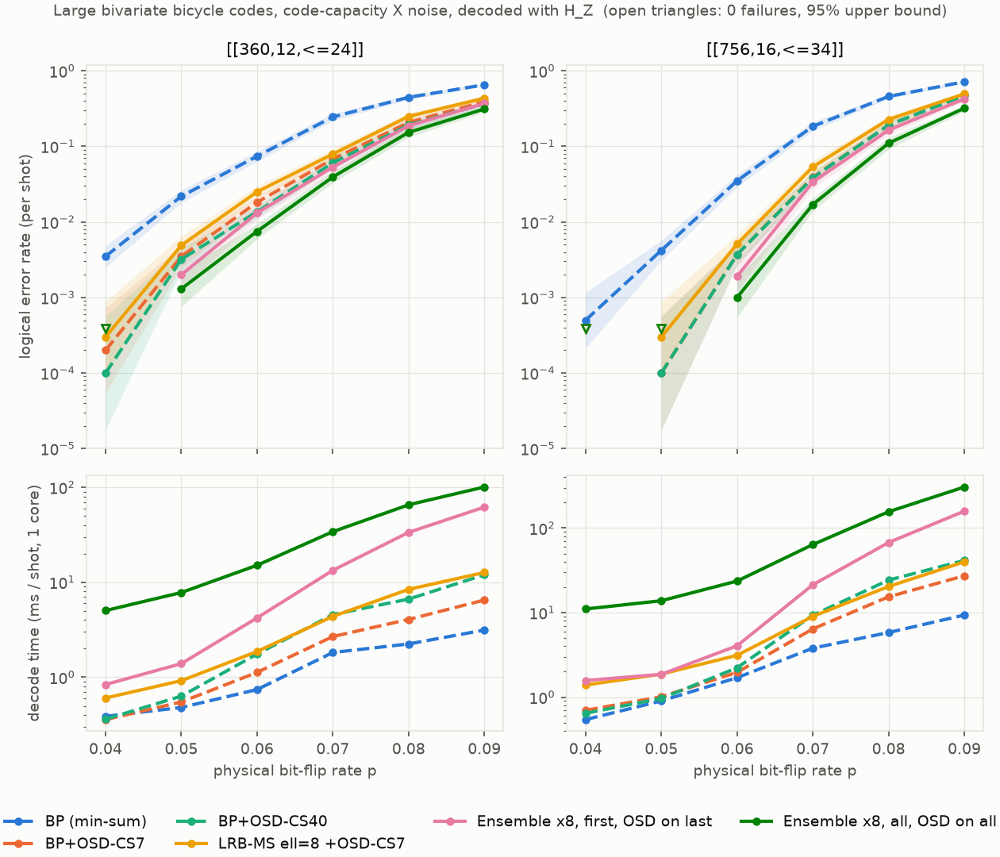

# Benchmark: bivariate bicycle codes (code capacity)

We ran the same code-capacity bit-flip benchmark as for [quantum Tanner codes](quantum_tanner.md) on the bivariate bicycle (BB) codes of
Bravyi et al. (arXiv:2308.07915): [[72,12,6]], [[144,12,12]] and [[288,12,18]].
Decoding uses `H_Z`, and every decoder sees the same error samples.
A point stops at 100 failures or 20 000 shots.
All decoders use a serial schedule, at most 100 iterations and min-sum scaling 0.75.
The ensembles use 8 greedy `ell = 8` groupings.

## Logical error rate per shot

`0 (/N)` means no failures in `N` shots.

**[[72,12,6]]**

| decoder | 0.03 | 0.04 | 0.05 | 0.06 | 0.07 | 0.08 | ms/shot @ p=0.05 |
|---|---|---|---|---|---|---|---|
| BP (min-sum) | 3.0e-02 | 8.3e-02 | 1.5e-01 | 2.4e-01 | 3.7e-01 | 4.7e-01 | 0.06 |
| BP+OSD-CS7 | 3.0e-02 | 7.9e-02 | 1.5e-01 | 2.4e-01 | 3.6e-01 | 4.5e-01 | 0.07 |
| BP+OSD-CS40 | 3.0e-02 | 7.9e-02 | 1.5e-01 | 2.4e-01 | 3.6e-01 | 4.5e-01 | 0.09 |
| Qulid ell=8 + OSD-CS7 | 3.3e-02 | 8.0e-02 | 1.7e-01 | 2.4e-01 | 3.8e-01 | 4.6e-01 | 0.09 |
| **Ensemble ×8, first** | 3.5e-02 | 8.0e-02 | 1.7e-01 | 2.4e-01 | 3.8e-01 | 4.6e-01 | 0.11 |
| **Ensemble ×8, all** | 3.0e-02 | 7.2e-02 | 1.6e-01 | 2.3e-01 | 3.6e-01 | 4.6e-01 | 0.49 |

**[[144,12,12]]**

| decoder | 0.03 | 0.04 | 0.05 | 0.06 | 0.07 | 0.08 | ms/shot @ p=0.05 |
|---|---|---|---|---|---|---|---|
| BP (min-sum) | 3.3e-03 | 2.0e-02 | 5.8e-02 | 1.7e-01 | 2.8e-01 | 4.5e-01 | 0.10 |
| BP+OSD-CS7 | 1.4e-03 | 8.3e-03 | 2.5e-02 | 1.0e-01 | 1.8e-01 | 3.1e-01 | 0.12 |
| BP+OSD-CS40 | 1.3e-03 | 7.8e-03 | 2.2e-02 | 9.0e-02 | 1.6e-01 | 2.9e-01 | 0.16 |
| Qulid ell=8 + OSD-CS7 | 1.5e-03 | 1.1e-02 | 2.9e-02 | 1.1e-01 | 2.0e-01 | 2.9e-01 | 0.22 |
| **Ensemble ×8, first** | 1.3e-03 | 9.0e-03 | 2.6e-02 | 1.0e-01 | 1.8e-01 | 2.8e-01 | 0.39 |
| **Ensemble ×8, all** | 1.0e-03 | 7.8e-03 | 2.3e-02 | 8.6e-02 | 1.7e-01 | 2.8e-01 | 1.71 |

**[[288,12,18]]**

| decoder | 0.03 | 0.04 | 0.05 | 0.06 | 0.07 | 0.08 | ms/shot @ p=0.05 |
|---|---|---|---|---|---|---|---|
| BP (min-sum) | 2.0e-04 | 3.7e-03 | 2.4e-02 | 8.8e-02 | 2.4e-01 | 4.9e-01 | 0.17 |
| BP+OSD-CS7 | 0 (/20000) | 4.0e-04 | 4.6e-03 | 2.7e-02 | 7.6e-02 | 2.3e-01 | 0.20 |
| BP+OSD-CS40 | 0 (/20000) | 3.5e-04 | 3.2e-03 | 2.0e-02 | 6.2e-02 | 2.1e-01 | 0.26 |
| Qulid ell=8 + OSD-CS7 | 0 (/20000) | 9.0e-04 | 6.8e-03 | 3.2e-02 | 1.0e-01 | 2.8e-01 | 0.39 |
| **Ensemble ×8, first** | 0 (/20000) | 5.0e-04 | 2.4e-03 | 2.1e-02 | 6.8e-02 | 2.3e-01 | 0.64 |
| **Ensemble ×8, all** | 0 (/20000) | 2.5e-04 | 1.6e-03 | 1.5e-02 | 5.2e-02 | 1.8e-01 | 3.05 |

## How much can be gained?

To size the headroom, we estimated how an optimal minimum-weight decoder would do on the same
samples. A shot counts as a sure failure if any decoder found a valid correction in the wrong
logical class that is lighter than the true error. Wrong-class corrections of equal weight count
as half a failure, since no minimum-weight rule can break the tie.

| code, p | min-weight estimate | BP+OSD-CS7 | BP+OSD-CS40 | ensemble ×4, all |
|---|---|---|---|---|
| [[144,12,12]], 0.03 | ≈ 8e-4 | 8.8e-4 | 7.5e-4 | 1.1e-3 |
| [[144,12,12]], 0.05 | ≈ 1.9e-2 | 3.0e-2 | 2.8e-2 | 2.6e-2 |
| [[288,12,18]], 0.05 | ≈ 4e-4 | 4.6e-3 | 3.8e-3 | 1.7e-3 |
| [[288,12,18]], 0.07 | ≈ 2.4e-2 | 9.2e-2 | 8.3e-2 | 7.5e-2 |

## Findings

- **On BB codes a single Qulid decoder does not beat BP+OSD.** Unlike the Tanner codes, BB
  checks do not combine into strong local codes. Groupings cut the error rate of plain min-sum BP
  by up to about 2×, but stay well above BP+OSD. This holds for greedy groupings and for groupings
  that follow the code's algebra (cosets of the x and y shifts). The exact per-GC trellis is no
  better either. With an OSD fallback, one Qulid decoder is
  slightly worse than BP+OSD-CS7.
- **The failures are fixable by regrouping.** When Qulid fails, it either does not converge or
  converges to a valid but heavier correction in the wrong logical class. A different grouping
  often succeeds on the same syndrome.
- **The grouping ensemble is the improvement.** On [[288,12,18]] at p = 0.05, "ensemble ×8, all"
  lowers the logical error rate to 1.6e-3, compared with 4.6e-3 for BP+OSD-CS7 and 3.2e-3 for
  BP+OSD-CS40. That is 1.9× better than the stronger baseline. It costs about 12× the
  decode time of BP+OSD-CS40.
- **"Ensemble ×8, first" is the cheaper option.** It stops at the first converged grouping and runs
  OSD only on the last. It beats BP+OSD-CS40 by about 1.3× at p = 0.05 for about 2.4× the time, and
  roughly matches or trails it slightly at p ≥ 0.06.
- **The small codes have no headroom.** On [[72,12,6]] and [[144,12,12]], BP+OSD is already close
  to the minimum-weight estimate, and the ensemble at best matches BP+OSD-CS40.
- **The larger codes have room for further improvement.** On [[288,12,18]] even the best decoder
  is still 2–4× above the minimum-weight estimate. Promising next steps:
  - more diverse groupings (for example, mixing `ell` values);
  - a native C++ ensemble that shares the OSD elimination between members;
  - running the lowest-cost selection over OSD-CS candidates from several members' soft outputs.

## Larger BB codes: [[360,12,≤24]] and [[756,16,≤34]]

These are the two largest codes in Bravyi et al. The setup is the same: code-capacity bit flips,
the same six decoders, up to 10 000 shots per point.

> **Timing caveat:** while this benchmark ran, a leftover background job occupied the same 4 cores,
> so the absolute decode times in this section are likely about 2× too high. The extra load was
> constant throughout, so the relative speeds of the decoders should be roughly preserved.
> Logical error rates are unaffected.

**[[360,12,≤24]]**

| decoder | 0.04 | 0.05 | 0.06 | 0.07 | 0.08 | 0.09 | ms/shot @ p=0.06 |
|---|---|---|---|---|---|---|---|
| BP (min-sum) | 3.5e-03 | 2.2e-02 | 7.4e-02 | 2.4e-01 | 4.5e-01 | 6.5e-01 | 0.7 |
| BP+OSD-CS7 | 2.0e-04 | 3.5e-03 | 1.8e-02 | 6.8e-02 | 2.1e-01 | 3.9e-01 | 1.1 |
| BP+OSD-CS40 | 1.0e-04 | 3.2e-03 | 1.4e-02 | 6.0e-02 | 1.9e-01 | 3.7e-01 | 1.8 |
| Qulid ell=8 + OSD-CS7 | 3.0e-04 | 4.9e-03 | 2.5e-02 | 7.9e-02 | 2.5e-01 | 4.3e-01 | 1.9 |
| **Ensemble ×8, first** | 0 (/10000) | 2.0e-03 | 1.3e-02 | 5.3e-02 | 1.9e-01 | 3.7e-01 | 4.2 |
| **Ensemble ×8, all** | 0 (/10000) | 1.3e-03 | 7.5e-03 | 3.9e-02 | 1.5e-01 | 3.1e-01 | 15.1 |

**[[756,16,≤34]]**

| decoder | 0.04 | 0.05 | 0.06 | 0.07 | 0.08 | 0.09 | ms/shot @ p=0.06 |
|---|---|---|---|---|---|---|---|
| BP (min-sum) | 5.0e-04 | 4.2e-03 | 3.5e-02 | 1.8e-01 | 4.6e-01 | 7.1e-01 | 1.7 |
| BP+OSD-CS7 | 0 (/10000) | 1.0e-04 | 3.7e-03 | 3.9e-02 | 1.9e-01 | 4.7e-01 | 2.0 |
| BP+OSD-CS40 | 0 (/10000) | 1.0e-04 | 3.7e-03 | 3.8e-02 | 1.9e-01 | 4.7e-01 | 2.2 |
| Qulid ell=8 + OSD-CS7 | 0 (/10000) | 3.0e-04 | 5.1e-03 | 5.3e-02 | 2.3e-01 | 4.9e-01 | 3.1 |
| **Ensemble ×8, first** | 0 (/10000) | 0 (/10000) | 1.9e-03 | 3.4e-02 | 1.6e-01 | 4.2e-01 | 4.0 |
| **Ensemble ×8, all** | 0 (/10000) | 0 (/10000) | 1.0e-03 | 1.7e-02 | 1.1e-01 | 3.2e-01 | 23.6 |

- **The ensemble's advantage grows with code size.** Comparing "ensemble ×8, all" with the stronger
  baseline, BP+OSD-CS40:
  - [[360,12,≤24]]: 2.5× fewer failures at p = 0.05 and 1.8× at p = 0.06;
  - [[756,16,≤34]]: 3.7× at p = 0.06, 2.3× at p = 0.07 and 1.7× at p = 0.08.

  Its decode time is about 8–11× that of BP+OSD-CS40 at p = 0.06.
- **"Ensemble ×8, first" is the cheap option.** It gives 1.6–1.9× fewer failures than BP+OSD-CS40
  at p = 0.05 on [[360]] and p = 0.06 on [[756]], for about 2× the time. At higher noise it roughly
  ties BP+OSD-CS40.
- **A single Qulid decoder with OSD fallback stays slightly behind BP+OSD** on these codes too.
  Raising the OSD order from 7 to 40 barely changes BP+OSD.

The BB construction, the exploration scripts, the headroom estimator (`mw_bound.py`) and the raw
data are in [`examples/bb`](../../examples/bb/README.md).

---
[← back to the README](../../README.md)
