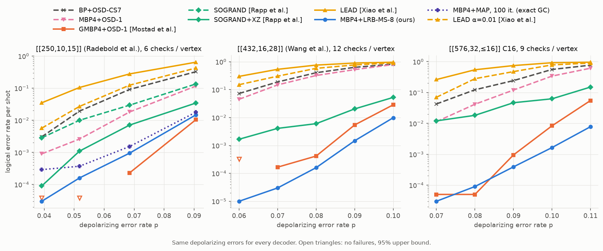

# Comparison with related generalized-check decoders

Three recent papers also decode quantum Tanner codes by treating each vertex's local code as one
generalized check. We implemented all three in this package and compared them with LRB-MS on
the same codes, the same noise and the same error samples.

| paper | idea | where it lives here |
|---|---|---|
| Mostad, Rosnes and Lin, [arXiv:2603.05486](https://arxiv.org/abs/2603.05486) | MBP4 with each generalized check decoded by exact MAP (BCJR on a syndrome trellis); hybrid with plain MBP4 first and OSD-1 last | `gc_method="map"`, `GmbpDecoder`, `union_overlap_check_groups` |
| Rapp, Médard, Tang and Duffy, [arXiv:2603.18318](https://arxiv.org/abs/2603.18318) | each generalized check decoded by soft-output GRAND: an ORBGRAND list plus the probability that the true pattern is not in it | `gc_method="sogrand"` |
| Xiao, Shi, Huang, Wang and Wang, [arXiv:2605.17796](https://arxiv.org/abs/2605.17796) | LEAD: BP-LSD on every local code, local estimates averaged into a prior, then global BP-OSD (one pass) | `LeadDecoder` |

LRB-MS sits between the first two. Like SOGRAND it scores a short list of local patterns
instead of the whole coset; unlike SOGRAND the list comes from a least-reliable-basis
re-encoding and the output is max-log. Exact MAP is the reference for both.

## Implementation notes

- **MAP check (Mostad et al., Alg. 2):** forward/backward over the 2^ℓ-state syndrome trellis
  in the probability domain. Each step keeps unit total mass, so no rescaling is needed. The
  output is extrinsic. With one row per check it is the box-plus rule, so single-row MAP equals
  `ldpc`'s product-sum BP (tested).
- **GMBP4 (Mostad et al., Alg. 3):** their variable rule scales check outputs by 1/a in both
  the posterior and the outgoing messages, with a flooding schedule. That is
  `MbpLrbmsDecoder(gc_method="map", mu=1/a, alpha=1, schedule="parallel")`. `GmbpDecoder` adds
  their hybrid: 6 iterations of MBP4 with box-plus single-row checks, then 6 iterations with
  generalized checks, then OSD-1. OSD-1 is `ldpc`'s combination sweep of order 1 (order 0 is
  OSD-0 in `ldpc`). It runs on each CSS half that still violates its syndrome, from the
  marginals of the quaternary posteriors. a = 1.6 for quantum Tanner codes and 1.5 for BB.
- **SOGRAND (Rapp et al.):** written from the papers' description. Their reference code is
  under a non-commercial licence and was only read, not copied. Details:
  - patterns are queried in 1-line ORBGRAND order with the automatic intercept;
  - the search stops at list size 4, or once the estimated probability that the true pattern
    is not in the list (2^-rank × unqueried mass) is below 10^-5;
  - the not-in-list mass is spread over the bits by their input marginals, and the output is
    extrinsic;
  - the binary variant decodes X and Z independently with the marginal rate 2p/3; the X/Z-aware
    variant runs inside MBP4 with a = 1, which is their correlation-aware message passing;
  - 200 iterations, no normalisation.
  Within one pattern weight the query order is lexicographic, where the reference uses its
  "landslide" order. It is tested against an independent Python transcription and, with an
  unlimited list, against exact MAP.
- **LEAD (Xiao et al., Alg. 1):** local BP-LSD (`lsd_cs`, order 3, min-sum, iterations = local
  length) on each vertex's local code. Bits the local decision flips are raised to at least 0.5.
  The local estimates are averaged and scaled (α = 1), and a global BP-OSD (`osd_cs`, order 3,
  min-sum, iterations = n) runs from that prior. X and Z are decoded independently at 2p/3.
  The paper does not say how local views with a zero syndrome enter the average (`ldpc`'s
  BP-LSD skips them). We use the channel prior.
- **LRB-MS (ours):** `MbpLrbmsDecoder` with one generalized check per vertex, LRB order 8,
  serial schedule, α = 1, at most 100 iterations, no OSD. μ was chosen per code on separate
  error samples: 0.95 for [[250,10,15]], whose local codes are high-rate (6 checks on 25 bits),
  and 0.75 for the other two.

All decoders see the same depolarizing errors (p total, p/3 per Pauli). A shot fails if a
decoded half misses its syndrome or the residual flips a logical. Decode time is the mean wall
time per shot on one core (four workers in parallel). Everything is C++ except two Python
wrappers: LEAD's loop over local decoders and GMBP4's stage switch. The scripts are in
[`examples/related_work`](../../examples/related_work).

## Validation against the papers

Each reimplementation was checked against numbers from its own paper before comparing. For
SOGRAND they come from the result files in the authors' repository; for the others they are
read off the papers' figures, so they are approximate.

| paper, code | decoder | p | paper | ours |
|---|---|---|---|---|
| Rapp et al., [[250,10,15]] | SOGRAND (binary, 200 it.) | 0.0392 | 3.3e-3 | 2.8e-3 (50/17 600) |
| | SOGRAND+XZ (200 it.) | 0.0392 | 9.1e-5 | 9.0e-5 (9/100 000) |
| | BP, sum-product, normalised 0.8 | 0.0392 | ≈ 1.6e-2 (between 0.0373 and 0.0535) | 2.1e-2 (30/1 400) |
| Mostad et al., [[432,16]] (Fig. 3) | MBP4+OSD-1 (r = 1) | 0.05 / 0.08 | ≈ 1e-2 / ≈ 0.35 | 1.0e-2 / 0.33 |
| | GMBP4+OSD-1, r = 12 (full grouping) | 0.08 | ≈ 7e-4 | 0 / 3 000 |
| | GMBP4+OSD-1, r = 3 (rows sharing an H_B row) | 0.05 / 0.08 | ≈ 4e-4 / ≈ 0.1 | 3.3e-4 / 6.6e-2 |
| | GMBP4+OSD-1, r = 4 (rows sharing an H_A row) | 0.08 | ≈ 0.1 | 3.6e-2 |
| Xiao et al., [[36,8,3]] (Fig. 4a) | BP-OSD (min-sum, OSD-CS3) | 0.01 / 0.02 / 0.03 | ≈ 9e-3 / 3.6e-2 / 7.6e-2 | 1.1e-2 / 3.8e-2 / 8.2e-2 |
| | LEAD (BL–BO, α = 1) | 0.01 / 0.02 / 0.03 | ≈ 6.5e-3 / 2.6e-2 / 6.0e-2 | 8.8e-3 / 3.4e-2 / 8.1e-2 |

- **SOGRAND** reproduces the published numbers closely: the X/Z-aware result is within 1% of
  the paper's at p = 0.0392.
- **GMBP4** reproduces Mostad et al.'s baseline and partial groupings. Our r = 3 and r = 4
  curves sit at or slightly below theirs.
- **LEAD:** our BP-OSD baseline matches the paper's, but our LEAD gains less: 1.0–1.25× over
  BP-OSD instead of about 1.4×. Neither alternative for zero-syndrome views (estimate 0, or
  leave them out of the average) closes the gap. Leaving them out is much worse. The remaining
  difference is in details the paper does not give, so the LEAD numbers below are those of our
  reimplementation.

## Head-to-head

Decoders at their papers' settings: GMBP4 with a = 1.6, 6 + 6 iterations and OSD-1; SOGRAND
with list size 4 and 200 iterations; LEAD with α = 1 and with the α = 0.01 regularisation the
paper uses for overconfident local decoders. Ours is MBP4 + LRB-MS-8 with one generalized check
per vertex, at most 100 iterations and no OSD.

**Mean decode time per shot (one core), one noise level per code:**

| code (checks per vertex) | p | **ours** | GMBP4+OSD-1 [Mostad] | SOGRAND+XZ [Rapp] | LEAD α=0.01 [Xiao] | MBP4+OSD-1 |
|---|---|---|---|---|---|---|
| [[250,10,15]] (6) | 0.0518 | **0.37 ms** | 1.6 ms | 0.90 ms | 2.0 ms | 1.6 ms |
| [[432,16,28]] (12) | 0.08 | **1.1 ms** | 71 ms | 27 ms | 32 ms | 33 ms |
| [[576,32,≤16]] C16 (9) | 0.09 | **1.4 ms** | 20 ms | 10 ms | 26 ms | 19 ms |

### Findings

- **[[432,16,28]], the code of Mostad et al. (12 checks per vertex):**
  - LRB-MS has 2.6–6× fewer failures than GMBP4 (e.g. 1.6e-4 vs 4.2e-4 at p = 0.08) and is
    47–67× faster.
  - Against SOGRAND+XZ it has 5–170× fewer failures and is 24–33× faster.
  - The exact MAP check scans a 4096-state trellis over 48 bits, and SOGRAND needs about 2^12
    queries per list entry. LRB-MS does one reliability-ordered elimination and scores a short
    list, so its cost hardly depends on the number of checks per vertex.
- **C16 [[576,32]] (9 checks per vertex):**
  - LRB-MS matches GMBP4 where both rarely fail (p ≤ 0.08), and fails 2.4–7× less often
    above that.
  - It is 11–16× faster than GMBP4.
  - It beats SOGRAND+XZ by 19–400× in error rate and 5–12× in time.
- **[[250,10,15]], the code of Rapp et al. (6 checks per vertex):**
  - With only 64 trellis states per check, exact MAP is cheap, and GMBP4 is the most accurate
    decoder here: no failures in 100 000 shots at p ≤ 0.0518, and 1.4–4× fewer failures than
    LRB-MS above that, at 3–5× its time.
  - LRB-MS beats SOGRAND+XZ by 2.3–7.5× in error rate, at a half to a quarter of its time.
- **An exact check update alone is not enough.** "MBP4+MAP" uses exact MAP checks without
  damping (a = 1) and without OSD. It is worse than both GMBP4 and LRB-MS at every noise
  level on [[250,10,15]], by up to 10×. GMBP4 gets its accuracy from the 1/a = 0.625 damping and the OSD-1 fallback
  as much as from exact checks. LRB-MS uses the damping μ instead (0.95 here).
- **X/Z correlation matters for all of them.** SOGRAND+XZ is 4–32× better than binary SOGRAND
  on [[250,10,15]], the gain Rapp et al. report.
- **LEAD does not help at these noise levels.** In the range compared here (p ≥ 0.039), LEAD is
  worse than plain BP+OSD-CS7, even with α = 0.01. The LEAD paper evaluates p ≤ 0.03, where
  our reimplementation reproduced a smaller version of its gain (see the validation above).
  Its time is dominated by a Python loop over the local decoders, so treat LEAD's timings as an
  upper bound.
- **BB [[144,12,12]] (control, no local code structure):** the generalized decoders are close
  to plain MBP4+OSD-1, as Mostad et al. found. GMBP4 uses Algorithm 1 groups of 8 rows; ours
  uses overlap groups of 6 with the relay-tuned (μ, α) = (0.9, 1.1). Ours is 1.6–1.9× better
  than MBP4+OSD-1 at p = 0.05–0.06, at about half the time of MBP4+OSD-1 and GMBP4. Plain
  BP+OSD-CS7 is faster still, but 14–31× less accurate.

### Caveats

- LRB-MS's μ was tuned per code on separate samples. The other decoders use their papers'
  settings, which their authors tuned on their own codes; GMBP4's a = 1.6 was chosen on the
  [[432,16]] code itself.
- Every decoder runs single-threaded. SOGRAND's queries and the MAP trellis both parallelise
  well in hardware, as their authors note.
- Our SOGRAND queries patterns of equal weight in lexicographic order rather than the
  reference's order. Its error rates match the published ones (validation table).

### Full results

**[[250,10,15]]**, logical error rate

| decoder | p = 0.0392 | p = 0.0518 | p = 0.0685 | p = 0.0906 |
|---|---|---|---|---|
| BP+OSD-CS7 | 3.0e-03 | 1.9e-02 | 9.1e-02 | 3.3e-01 |
| MBP4+OSD-1 | 9.0e-04 | 2.6e-03 | 1.8e-02 | 1.2e-01 |
| GMBP4+OSD-1 [Mostad et al.] | 0 (/100000) | 0 (/100000) | 2.3e-04 | 1.0e-02 |
| SOGRAND [Rapp et al.] | 2.8e-03 | 1.0e-02 | 2.9e-02 | 1.4e-01 |
| SOGRAND+XZ [Rapp et al.] | 9.0e-05 | 1.1e-03 | 7.1e-03 | 3.4e-02 |
| LEAD [Xiao et al.] | 3.5e-02 | 1.0e-01 | 2.8e-01 | 6.4e-01 |
| MBP4+LRB-MS-8 (ours) | 3.0e-05 | 1.6e-04 | 9.5e-04 | 1.5e-02 |
| MBP4+MAP, 100 it. (exact GC) | 2.9e-04 | 3.7e-04 | 1.5e-03 | 1.8e-02 |
| LEAD α=0.01 [Xiao et al.] | 5.7e-03 | 2.7e-02 | 1.2e-01 | 4.2e-01 |

**[[250,10,15]]**, mean decode time per shot

| decoder | p = 0.0392 | p = 0.0518 | p = 0.0685 | p = 0.0906 |
|---|---|---|---|---|
| BP+OSD-CS7 | 0.15 ms | 0.37 ms | 0.58 ms | 1.38 ms |
| MBP4+OSD-1 | 1.14 ms | 1.60 ms | 2.16 ms | 3.21 ms |
| GMBP4+OSD-1 [Mostad et al.] | 1.15 ms | 1.58 ms | 2.43 ms | 3.57 ms |
| SOGRAND [Rapp et al.] | 0.65 ms | 1.03 ms | 1.74 ms | 5.33 ms |
| SOGRAND+XZ [Rapp et al.] | 0.67 ms | 0.90 ms | 1.44 ms | 4.22 ms |
| LEAD [Xiao et al.] | 2.30 ms | 4.72 ms | 5.88 ms | 6.71 ms |
| MBP4+LRB-MS-8 (ours) | 0.32 ms | 0.37 ms | 0.51 ms | 1.11 ms |
| MBP4+MAP, 100 it. (exact GC) | 0.68 ms | 0.78 ms | 1.11 ms | 2.01 ms |
| LEAD α=0.01 [Xiao et al.] | 1.52 ms | 1.96 ms | 2.82 ms | 4.58 ms |

**[[432,16,28]]**, logical error rate

| decoder | p = 0.06 | p = 0.07 | p = 0.08 | p = 0.09 | p = 0.1 |
|---|---|---|---|---|---|
| BP+OSD-CS7 | 7.2e-02 | 1.9e-01 | 4.0e-01 | 6.3e-01 | 8.1e-01 |
| MBP4+OSD-1 | 4.5e-02 | 1.5e-01 | 3.2e-01 | 5.2e-01 | 7.9e-01 |
| GMBP4+OSD-1 [Mostad et al.] | 0 (/12000) | 1.7e-04 | 4.2e-04 | 5.4e-03 | 2.9e-02 |
| SOGRAND+XZ [Rapp et al.] | 1.7e-03 | 4.1e-03 | 6.0e-03 | 2.0e-02 | 5.2e-02 |
| LEAD [Xiao et al.] | 3.0e-01 | 5.3e-01 | 7.6e-01 | 8.9e-01 | 9.6e-01 |
| LEAD α=0.01 [Xiao et al.] | 1.5e-01 | 3.0e-01 | 5.8e-01 | 7.7e-01 | 9.1e-01 |
| MBP4+LRB-MS-8 (ours) | 1.0e-05 | 3.0e-05 | 1.6e-04 | 1.5e-03 | 9.8e-03 |

**[[432,16,28]]**, mean decode time per shot

| decoder | p = 0.06 | p = 0.07 | p = 0.08 | p = 0.09 | p = 0.1 |
|---|---|---|---|---|---|
| BP+OSD-CS7 | 3.21 ms | 7.61 ms | 14.48 ms | 22.55 ms | 33.25 ms |
| MBP4+OSD-1 | 18.59 ms | 24.32 ms | 32.66 ms | 35.37 ms | 44.96 ms |
| GMBP4+OSD-1 [Mostad et al.] | 41.86 ms | 57.61 ms | 70.80 ms | 87.43 ms | 102.27 ms |
| SOGRAND+XZ [Rapp et al.] | 17.42 ms | 22.06 ms | 27.39 ms | 42.95 ms | 71.05 ms |
| LEAD [Xiao et al.] | 21.78 ms | 32.96 ms | 47.19 ms | 56.53 ms | 57.34 ms |
| LEAD α=0.01 [Xiao et al.] | 11.33 ms | 21.84 ms | 32.08 ms | 46.74 ms | 56.53 ms |
| MBP4+LRB-MS-8 (ours) | 0.73 ms | 0.86 ms | 1.07 ms | 1.48 ms | 2.17 ms |

**[[576,32,≤16]] C16**, logical error rate

| decoder | p = 0.07 | p = 0.08 | p = 0.09 | p = 0.1 | p = 0.11 |
|---|---|---|---|---|---|
| BP+OSD-CS7 | 4.3e-02 | 1.2e-01 | 2.4e-01 | 5.6e-01 | 7.7e-01 |
| MBP4+OSD-1 | 1.1e-02 | 4.2e-02 | 1.2e-01 | 3.4e-01 | 6.1e-01 |
| GMBP4+OSD-1 [Mostad et al.] | 5.0e-05 | 5.0e-05 | 9.5e-04 | 8.3e-03 | 5.5e-02 |
| SOGRAND+XZ [Rapp et al.] | 1.2e-02 | 1.8e-02 | 4.7e-02 | 6.2e-02 | 1.5e-01 |
| LEAD [Xiao et al.] | 2.6e-01 | 5.5e-01 | 7.4e-01 | 9.2e-01 | 9.6e-01 |
| LEAD α=0.01 [Xiao et al.] | 7.0e-02 | 2.8e-01 | 4.7e-01 | 7.8e-01 | 9.0e-01 |
| MBP4+LRB-MS-8 (ours) | 3.0e-05 | 9.0e-05 | 3.9e-04 | 1.6e-03 | 7.8e-03 |

**[[576,32,≤16]] C16**, mean decode time per shot

| decoder | p = 0.07 | p = 0.08 | p = 0.09 | p = 0.1 | p = 0.11 |
|---|---|---|---|---|---|
| BP+OSD-CS7 | 1.50 ms | 3.15 ms | 6.79 ms | 14.87 ms | 21.50 ms |
| MBP4+OSD-1 | 9.92 ms | 15.25 ms | 18.97 ms | 25.37 ms | 30.41 ms |
| GMBP4+OSD-1 [Mostad et al.] | 10.88 ms | 14.97 ms | 20.02 ms | 25.76 ms | 35.08 ms |
| SOGRAND+XZ [Rapp et al.] | 5.52 ms | 6.76 ms | 10.09 ms | 14.87 ms | 28.57 ms |
| LEAD [Xiao et al.] | 17.73 ms | 27.45 ms | 36.94 ms | 53.91 ms | 57.58 ms |
| LEAD α=0.01 [Xiao et al.] | 8.62 ms | 18.01 ms | 26.10 ms | 43.16 ms | 54.74 ms |
| MBP4+LRB-MS-8 (ours) | 1.00 ms | 1.15 ms | 1.36 ms | 1.62 ms | 2.31 ms |

**BB [[144,12,12]]**, logical error rate

| decoder | p = 0.04 | p = 0.05 | p = 0.06 |
|---|---|---|---|
| BP+OSD-CS7 | 3.1e-03 | 1.1e-02 | 2.0e-02 |
| MBP4+OSD-1 | 9.0e-05 | 6.0e-04 | 2.8e-03 |
| GMBP4+OSD-1 [Mostad et al.] | 1.1e-04 | 4.1e-04 | 2.3e-03 |
| MBP4+LRB-MS-6 (ours) | 1.0e-04 | 3.7e-04 | 1.5e-03 |

**BB [[144,12,12]]**, mean decode time per shot

| decoder | p = 0.04 | p = 0.05 | p = 0.06 |
|---|---|---|---|
| BP+OSD-CS7 | 0.04 ms | 0.06 ms | 0.08 ms |
| MBP4+OSD-1 | 0.30 ms | 0.33 ms | 0.41 ms |
| GMBP4+OSD-1 [Mostad et al.] | 0.30 ms | 0.41 ms | 0.55 ms |
| MBP4+LRB-MS-6 (ours) | 0.15 ms | 0.18 ms | 0.28 ms |

---
[← back to the README](../../README.md)
