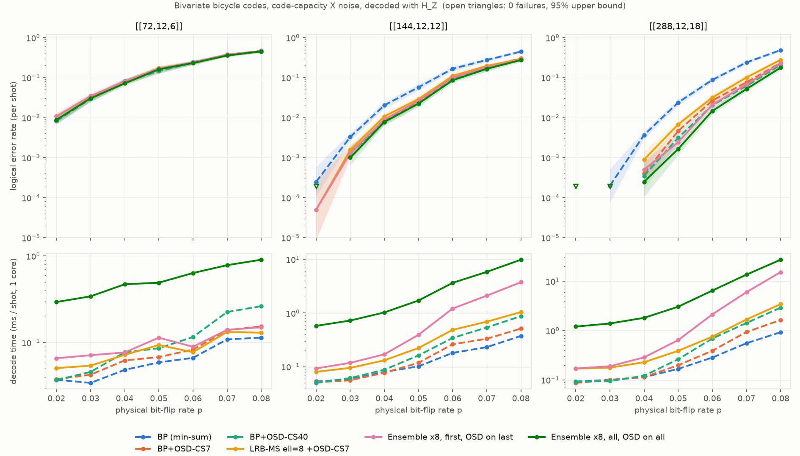

# LRB-MS on bivariate bicycle codes

The results and findings are in the [main README](../../README.md#benchmark-bivariate-bicycle-codes).



## Files

- `bb_codes.py` builds the BB codes of Bravyi et al. (`H_X = [A|B]`, `H_Z = [B^T|A^T]`), their CSS
  logicals, and `coset_groups` (check groupings along cosets of the x and y shifts).
- `harness.py` holds the paired code-capacity simulation (X errors decoded with `H_Z`) and the
  decoder factory.
- `benchmark_bb.py` runs the main sweep from `codes.json` and `decoders.json` into `results.json`.
  `results_table.md` holds the full numbers.
- `mw_bound.py` estimates what a minimum-weight decoder would achieve, by collecting valid
  wrong-class corrections that are lighter than, or as light as, the true error.
- `explore3.py`, `explore4.py` and `explore5.py` are the exploration runs: coset groupings,
  overlapping groups, and ensemble tuning on [[288,12,18]].

## Reproducing

```bash
pip install -e . matplotlib
cd examples/bb
python benchmark_bb.py
python -c "import sys; sys.path.insert(0, '../qtanner'); import plot_results as pr; \
pr.PLOT_EXCLUDE = set(); pr.main('results.json', 'codes.json', 'bb_benchmark.png', 'Bivariate bicycle codes')"
python mw_bound.py "[[288,12,18]]" 0.05 2400
```
