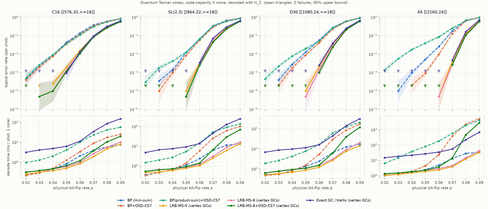

# Qulid on quantum Tanner codes

Code-capacity benchmark of `LrbmsDecoder` against BP and BP+OSD on
Leverrier–Zémor quantum Tanner codes.



## Setup

**Codes.** Qubits sit on the faces of the left-right Cayley complex of a group `G`
with symmetric generating sets `|A| = |B| = 6`. Each vertex applies a local
tensor code over its 6×6 faces. X checks are `C_A ⊗ C_B` and Z checks are
`C_A^⊥ ⊗ C_B^⊥`. `C_A` is a `[6,3,3]` code and `C_B` is a column permutation of it,
so each vertex contributes 9 checks of weight 9. `A` and `B` are drawn from
disjoint conjugacy-class unions, which enforces the total no-conjugacy condition.
Checks are built in `qtanner_codes.py`, and `H_X H_Z^T = 0` is asserted.

| label | group | n | k | d_X (upper bound) |
|---|---|---|---|---|
| C16 | cyclic, order 16 | 576 | 32 | ≤ 16 |
| SL(2,3) | order 24 | 864 | 22 | ≤ 21 (d_Z ≤ 18) |
| D30 | dihedral, order 30 | 1080 | 24 | ≤ 18 |
| A5 | alternating, order 60 | 2160 | 24 | not estimated |

The distance bounds come from 2000 random information-set trials (`distance.py`).
These are upper bounds, and the search gave no usable bound for A5.

**Noise and decoding.** Each qubit gets an X error independently with probability `p`.
The decoders see `s = H_Z e`. A shot fails if the residual `e + ê` has a nonzero
syndrome or is a nontrivial logical. For each `(code, p)`, every decoder decodes
the same error samples. Runs stop at 100 failures or 20 000 shots, or at 50 failures
or 3 000 shots for the trellis. Times are mean wall-clock per shot on one core
(4 workers in parallel).

**Decoders.** All run a serial schedule with at most 100 iterations.
Min-sum uses scaling 0.75, the best value in a sweep over 0.5–1.0 for BP and Qulid alike.

- BP (min-sum), BP+OSD-CS7 (min-sum), and BP(product-sum)+OSD-CS7 are the `ldpc` baselines.
- Qulid-`t` (vertex GCs) uses one generalized check per Tanner-graph vertex, i.e. the
  9 rows of that vertex's local tensor code (`code.vertex_groups("z")`).
- Qulid-8+OSD-CS7 falls back to OSD whenever Qulid does not converge.
- Exact GC / trellis computes the exact max-log update per vertex with a 512-state trellis.
- Qulid-8 with greedy `overlap_check_groups(H, 9)` rebuilds exactly the vertex groups on
  all four codes, so its results match the vertex-GC run. It is listed in `results_table.md`
  but left out of the plot.

## Results

Logical error rate per shot (LER), with failures/shots in brackets:

| code, p | BP (min-sum) | BP+OSD-CS7 | Qulid-8 (vertex GCs) |
|---|---|---|---|
| C16, 0.05 | 4.3e-2 | 3.7e-2 | 1.4e-3 (27/20000) |
| SL(2,3), 0.05 | 1.2e-2 | 8.4e-3 | 5e-5 (1/20000) |
| D30, 0.06 | 5.7e-2 | 4.1e-2 | 1.4e-3 (28/20000) |
| A5, 0.06 | 2.6e-2 | 9.7e-3 | 5e-5 (1/20000) |

- **Qulid with vertex GCs has a 20–200× lower LER than BP and BP+OSD across the range where
  both are measurable.** The waterfall moves from p ≈ 0.03–0.04 to p ≈ 0.06–0.07. The run is
  also as fast or faster: for p ≤ 0.06, Qulid-8 is within about 1.5× of plain BP's time
  and cheaper than BP+OSD at p ≥ 0.05.
- **OSD gains little on these codes.** When min-sum BP fails to converge, OSD-CS7 almost always
  returns a correction that satisfies the syndrome but is much heavier than the true error
  (about 60 flips against about 32 at p=0.05 on C16), which is a logical error.
  Product-sum BP makes OSD worse. It is also 4–40× slower and badly degraded on A5.
- **The grouping is where the gain comes from.** Even `t = 0` (order-1 re-encodings only)
  keeps most of the improvement. `t = 8` lowers the LER by another 1.2–1.5× for about 20% more time.
- **An OSD fallback after Qulid helps only slightly** (≤ 1.2×). By then the remaining failures
  are mostly unconverged high-weight patterns. At high p on A5 it also becomes very slow.
- **The exact trellis per GC does not beat Qulid-8.** It is equal within error bars, or slightly
  worse at high p, and 5–30× slower. The LRB candidate list already captures the local max-log
  decision, and what limits performance is the message passing between GCs. (The scaling 0.75
  was tuned for Qulid, not for the trellis.)

The full numbers are in `results_table.md`, and the raw data is in `results.json`.

## Reproducing

```bash
pip install -e .  qldpc matplotlib         # qldpc supplies the group tables
cd examples/qtanner
python search_codes.py S4 25               # optional: search for more instances
python benchmark.py --out results.json     # main sweep (a few hours on 4 cores)
python benchmark.py --decoders decoders_trellis.json --max-shots 3000 --max-fails 50 --out results.json
python plot_results.py
```

Group element indices in `codes.json` follow `qldpc` 0.3.3's `Group.generate()` order.
